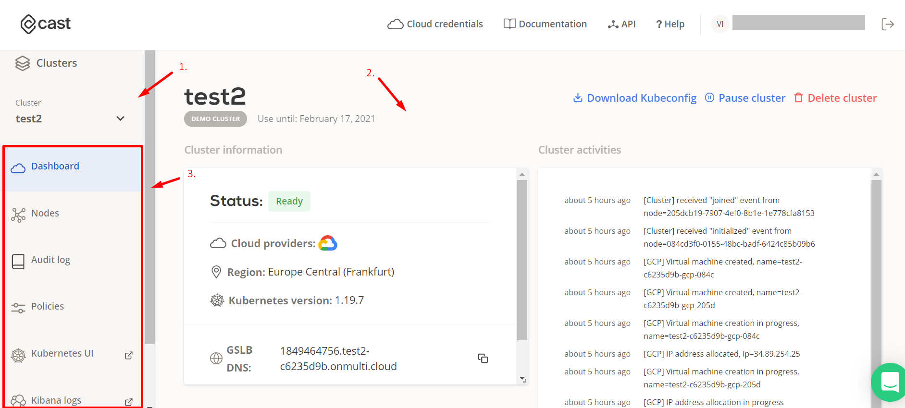
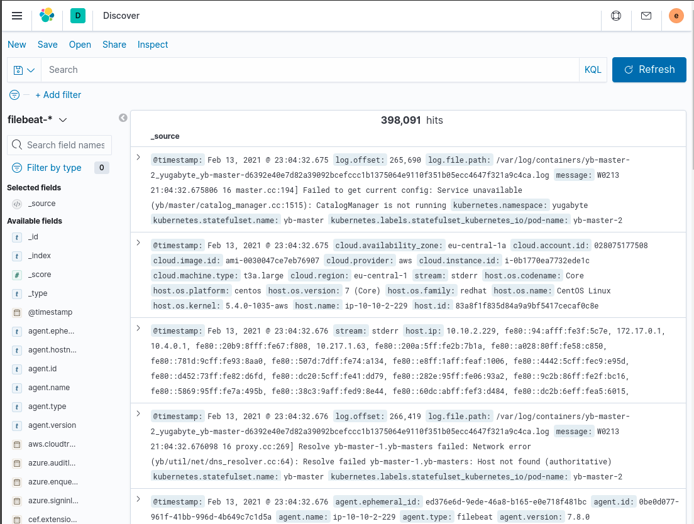

## Console overview

This is a quick overview of the [CAST AI console](https://console.cast.ai) and it's features.

- ### /dashboard

In the dashboard window you will see all active and deleted clusters.

1. Create a new cluster. If you can see only an option to create a cluster, please refer to [Getting started] to unlock other features.
2. Download KubeConfig of a cluster, pause or delete it.
3. You can open any specific cluster to manage its policies, add or remove nodes or check logs (check -> [/clusters](https://github.com/v1dm45/docs/blob/main/docs/Dashboard%20Overview/Console%20overview.md#clusters)). Copy cluster ID for API management.

- ### /clusters

When you open any cluster from the /dashboard menu you will arrive to /clusters management.

Here you will see more information about the selected cluster and will get access to the cluster management menu.

1. Quickly navigate through active clusters.
2. Information and log of the selected cluster.
3. Management menu.

  - #### /nodes
  
  View information about the selected cluster nodes and manage them here.
  
  1. Add a new node.
     - If your cluster runs on multiple clouds you will be able to specify a cloud provider for the node(s).
     - Specify a CAST shape for the node(s) - a virtual specification of a Virtual Machine computing unit.
     - Add multiple nodes at once (1-20).
     
  2. View information about nodes, copy node ID for API management and delete nodes.
  

  
  - #### /audit
  
  Audit log of cluster management on a high level.
  
  1. Select a date range for the log.
  2. View operations made and who initiated them.
  

  
  - #### /policies
  
  Manage policies for the selected cluster. Policies will help you optimize and reduce cost of your cloud bill and will automate the process of scaling up and down for you.
  
  1. **Cluster limits** - policies that limit the cluster scale to the defined limits. This policy has the highest priority, and all the other policies cannot scale the cluster over the defined limits.
     - **CPU policy** - This policy ensures that your cluster stays within the defined CPU minimum and maximum counts. Use this policy to create a guardrail against unexpected costs, in cases where traffic or workload requirements grow beyond budget expectations.

  2. **Pod autoscaler** - policies that scale the cluster pods based on demand (e.g. CPU or memory utilization). This policy is second in priority, after the limits policy.
     - **Horizontal pod autoscaler (HPA) policy** - This policy enables the Kubernetes Event Driven Autoscaler (KEDA) to automatically increase/decrease pod replica counts based on metrics. This enables cost savings by eliminating wasteful pods, and also ensures that your services are able to scale up to handle increased traffic and workload requirements.

  3. **Node autoscaler** - policies to scale cluster based on the CPU or memory demand
     - **Spot/Preemtive Instances policy** - This policy enables the CAST optimization engine to purchase Spot (AWS / Azure) or Preemptive (GCP) instances when pods are labeled by the user. CAST automatically handles instance interruptions and replaces instances when they are terminated by the CSP. Spot instances typically yield savings of 60-80%, and are useful for stateless workloads such as microservices. CAST AI currently supports AWS Spot instances, with GCP and Azure rolling out shortly.
     - **Unscheduled pods policy** - This policy automatically adds nodes to your cluster so that your pods have a place to run. Both CPU and Memory requirements are considered. You can use CAST specified labels to ensure that your pods run in a specific Cloud, or let the CAST AI optimization engine choose for you.
     - **Node Deletion Policy** - This policy will automatically remove nodes from your cluster when they no longer have scheduled workloads. This allows your cluster to maintain a minimal footprint and reduce cloud costs.
  

  
  - #### Kubernetes UI
  
  View more detailed information about the selected cluster and manage it in the [Kubernetes UI](https://kubernetes.io/docs/tasks/access-application-cluster/web-ui-dashboard/).
  
  - #### Kibana logs
  
  View Kibana logs of the selected cluster.
  
  
  
  - #### Grafana logs
  
  View Grafana logs of the selected cluster.
  
  
  
  
  
  
