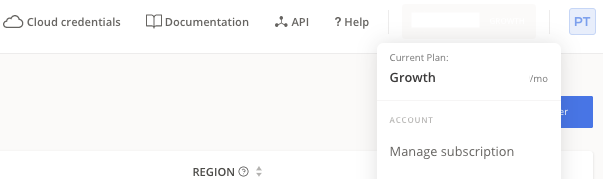
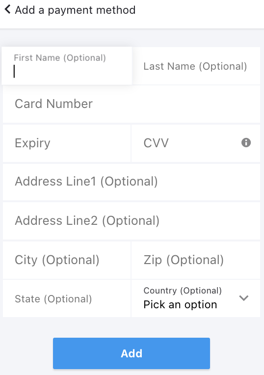

# Setup payment method

In order to setup a default payment method for your CAST AI subscription perform following steps:

 1. From your account menu, select **Manage subscription** option

    

 2. In the **Manage subscriptions** pop-up choose **Payment Methods**

    

 3. Enter all required details and submit the form by pressing **Add** button

To learn more about CAST AI subscription model visit our [pricing page](https://cast.ai/pricing/).
