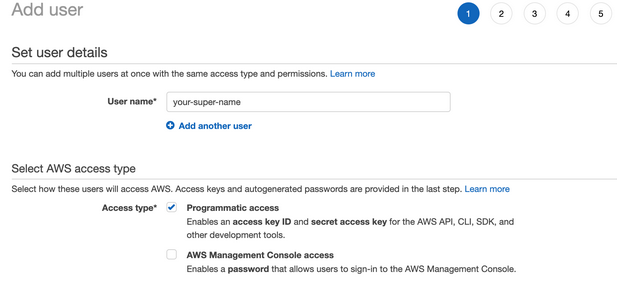

# Configure AWS credentials

After completing the following instructions, you’ll retrieve Access key ID and Secret access key. These credentials are by CAST AI for creating a cluster with AWS resources.

Open https://console.aws.amazon.com/.

Go to IAM service.

In the Users section, click on Add user:

Enter the User name, select Programmatic access type, and click next (permissions):

Click Create group, enter the Group name, and select the following permission policies:

* AmazonVPCFullAccess
* AmazonEC2FullAccess
* IAMFullAccess

Click the Create group button again.

Click next (tags) → next (review) → create user.

You will end up on a screen where you can retrieve credentials in AWS GUI or download credentials containing .csv file.

