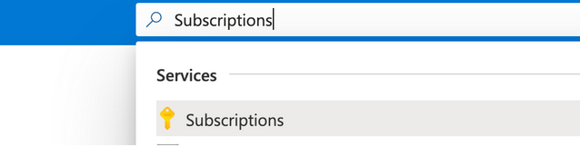
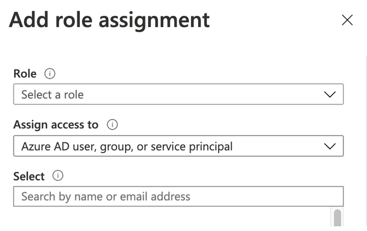
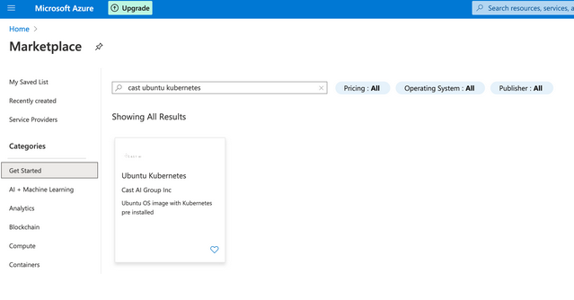
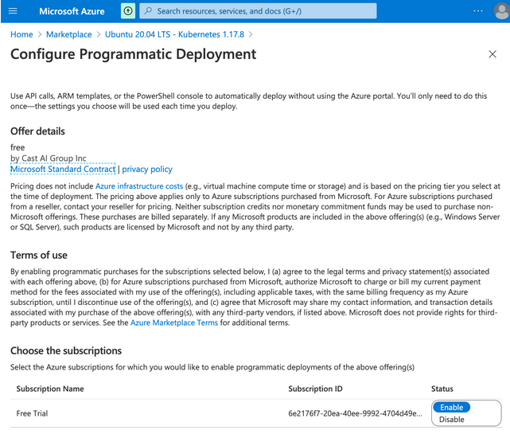

# Configure Azure credentials
The instructions we provide in this section will guide you in creating an external app registration. After completing the instructions, you’ll get keys similar to the following that allow CAST AI to access your Azure Subscription resources:

    tenant id: 355069b9-fbb7-yyyy-xxxx-83d5a8709111
    client id: 2d970aa5-4dde-yyyy-xxxx-36581dfff222
    client secret: xvKds90f83&&#$$qwerty
    subscription id: 697e39d3-4b01-yyyy-xxxx-75266e90c333

Open https://portal.azure.com/ and go to the **App registrations** section:

Click on **New registration** andcomplete the registration by entering the **Name** and selecting **Multi-tenant** access.

Once you complete the registration, you’ll end up on the App Overview page.

Save the Application (client) ID and Directory (tenant) ID from this page. They represent **Tenant ID** and **Client ID** keys from the required outputs of these instructions.

Click on **Certificates & secrets** in the **Manage** tab and click **New client secret**.

Enter meaningful **descriptions** and select **secret expiry time**. Click **Add**.

Copy the secret **value** you have created. It will be used as **Client Secret** when you enter it into CAST AI console.

###Give access to the CAST AI application by requesting a sign-in using a browser

1 - Make sure to click the link on the page where you have to paste the keys when you already have your Tenant ID entered.

2 - After login, you should see the **Permissions requested** window. Click Accept which will allow adding CAST AI application role.

Go to **Subscriptions**

Select **subscription** to which you want to give CAST AI access

Take note of the **Subscription ID**. This is the last item required for your Azure app credentials.

We have one more step left here. Create a Role assignment between the previously created App registration and this Subscription.

Go to **Access control (IAM)**.

Click on **Add → Add role assignment**

The following sidebar will appear

In the **Role** dropdown, select **Contributor**. In the **Select** search bar, enter the **name of created App Registration**. Select the App Icon and click Save.

You should find the created assignment with the Contributor role in the **Role assignments** column.

After taking all of the steps above, you should have the following keys:

    tenant id
    client-id
    client secret
    subscription id

**Consent to using CAST AI VM image from Azure Marketplace**

Before starting to create CAST AI clusters with Azure, as a provider's customer you will have to consent to use CAST AI image programmatically.

Go to [CAST AI VM image](https://portal.azure.com/#blade/Microsoft_Azure_Marketplace/MarketplaceOffersBlade/selectedMenuItemId/home/searchQuery/cast%20ubuntu%20kubernetes) in Azure Marketplace Search and click on CAST AI item in the search results.

The following page will be displayed. Click on -> _Want to deploy programmatically? **Get started**_

Click **Enable** next to the subscription that you will use for CAST AI services.

And you’re done!
