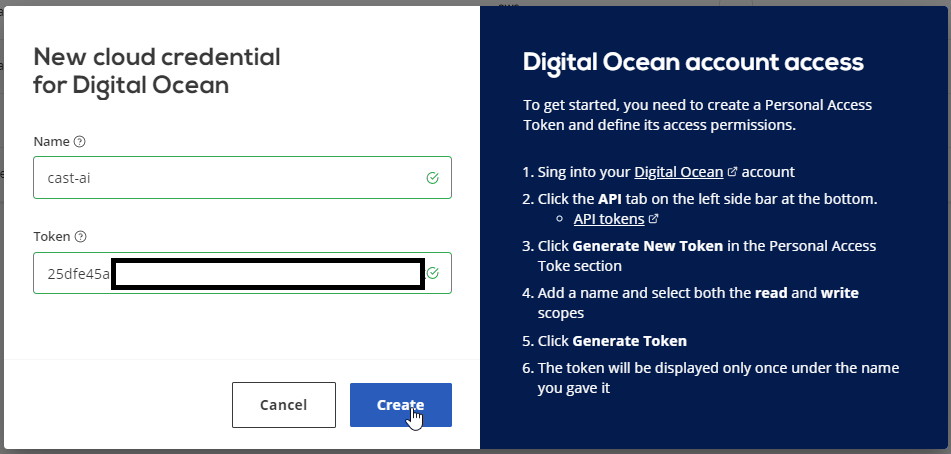

# Configure Digital Ocean credentials

These are the simple instructions to obtain your API access key from Digital Ocean.

First of all, [visit your Digital Ocean account.](https://cloud.digitalocean.com/)

Afterwards click on **API** in **Account** panel:

Click on **Generate New Token**:

Give it a name and make sure both **Read** and **Write** options are selected:

You will see your newly created access token. **Copy** it and **paste** it in CAST.AI Digital Ocean cloud credential pop-up.

That is it! Proceed creating your first Digital Ocean cluster!
