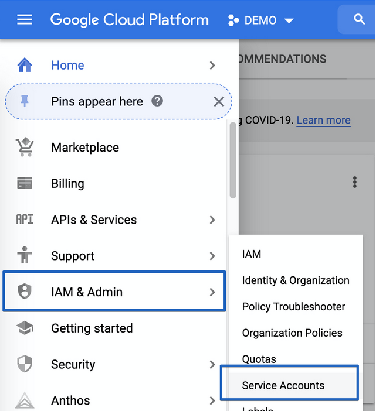
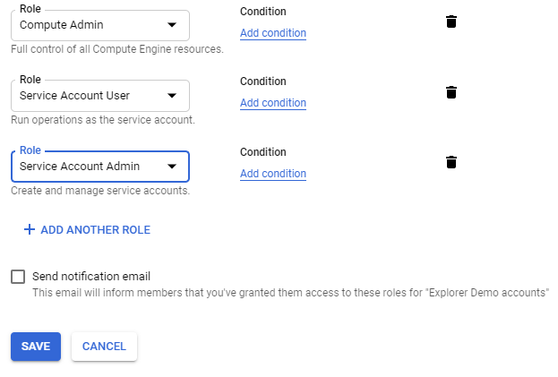

# Configure Google Cloud credentials

By following these instructions, you’ll retrieve the Service account JSON credentials. These credentials are required by
CAST AI for creating a cluster with GCP resources.

## Project prerequisites

**Note** that the project where your Service Account is created needs to have the following APIs enabled:

```
Compute API
Resource Manager API
```

Please follow the [GCP guide](https://cloud.google.com/apis/docs/getting-started#enabling_apis) on how to enable APIs.

### Create service account

1. Open [https://console.cloud.google.com/](https://console.cloud.google.com/)

2. Select your project (or create a new one) in the top bar.

    

3. Go to the Navigation bar, select **IAM & Admin**, and then **Service accounts**:

    

4. Click **Create service account**:

    

    Enter the preferred **Service account name** and **description**. Click **Create**

    

    Add the following roles to the created account:

    ```
    roles/compute.admin
    roles/iam.serviceAccountAdmin
    ```

    Click **Continue**.

    
    In the last step of the service account creation, click **Done** without entering any data.

    

### Create key

The created account will appear in the Service Accounts list. **Click on it** to access additional options.


In the **Keys** section, click on **Add Key → Create new key**.


Select the **JSON** option and click **Create**.


You’ll get a file download prompt. The downloaded file will include the **Service Account JSON credentials.**
