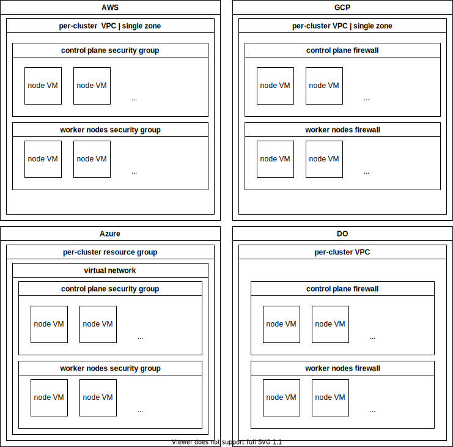

# Cluster infrastructure

## Nodes

Overview on where cluster virtual machines will be provisioned on your cloud:

### Ingress

CAST AI provisioned clusters contain all the infrastructure needed to equip your app with an external TLS endpoint:

* DNS entry to round-robin;
* Load-balancing infrastructure: cloud-native load balancers that route traffic to a sub-section of your cluster (e.g. traffic that hits AWS load balancer will route to AWS nodes);
* Nginx ingress controller, paired with TLS certificate manager, that listen to your deployed resources and maintain routing&TLS configuration;
* Metric collection for your ingress traffic;

All that is left for you as an application developer is to deploy your app, ingress resource, and configure a domain alias of your choice. See the [ingress guide](../guides/ingress.md) for more details.

### Network details

#### Region & zone

Each cloud maps a selected CAST AI region to a matching region on that cloud.

For example, **US East (Ashburn)** region maps to:

* AWS: us-east-1
* GCP: us-east4
* Azure: eastus

Currently, on each cloud CAST AI builds a single-zone setup of your cluster. Zone selection is cloud-specific.

#### Master nodes inbound

| Protocol | Port | Source | Description |
|---|---|---|---|
| tcp | 6443 | 0.0.0.0/0 | k8s API server |  
| udp | 51820 | 0.0.0.0/0 | WireGuard (if used)|

#### Worker nodes inbound

| Protocol | Port | Source | Description |
|---|---|---|---|
| udp | 51820 | 0.0.0.0/0 | WireGuard (if used) |
| tcp/udp | NodePort | 0.0.0.0/0 | k8s Service with type=LoadBalancer |

#### Subnets

| Range | Description |
|---|---|
| 10.96.0.0/12 | k8s services |
| 10.217.0.0/16 | k8s pods |
| 10.4.0.0/16 | WireGuard|
| 10.0.0.0/16 | GCP VPC. Smaller /24 blocks are allocated for subnets. |
| 10.10.0.0/16 | AWS VPC. Smaller /24 blocks are allocated for subnets. |
| 10.20.0.0/16 | AZURE VPC. Smaller /24 blocks are allocated for subnets. |
