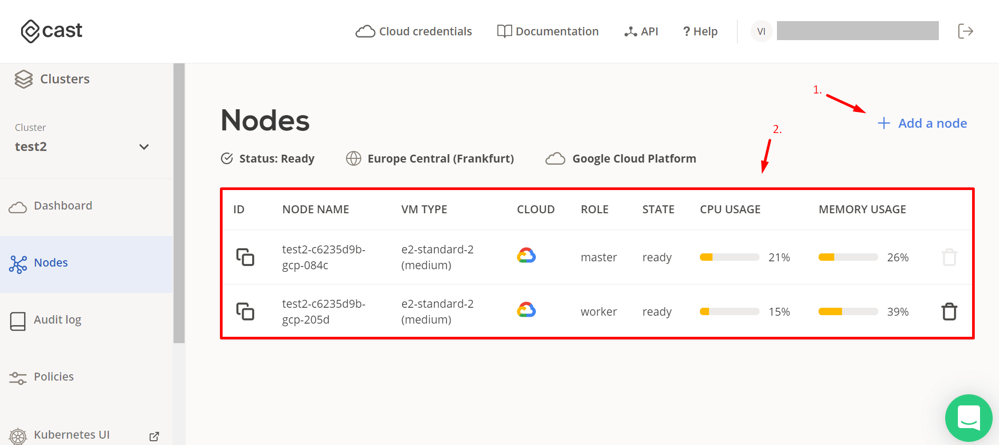

# Nodes

  View information about the selected cluster nodes and manage them here.

  1. Add a new node.
     - If your cluster runs on multiple clouds you will be able to specify a cloud provider for the node(s).
     - Specify a CAST shape for the node(s) - a virtual specification of a Virtual Machine computing unit.
     - Add multiple nodes at once (1-20).
  2. View information about nodes, copy node ID for API management, and delete nodes.

