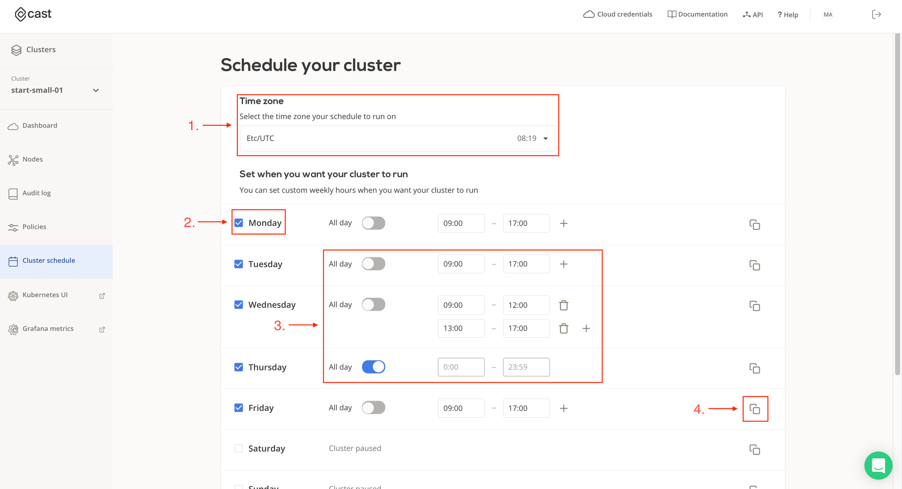
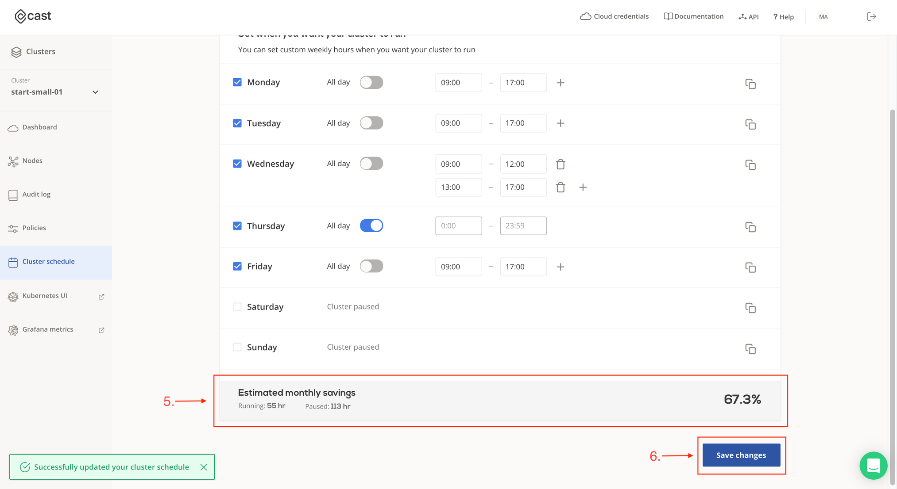
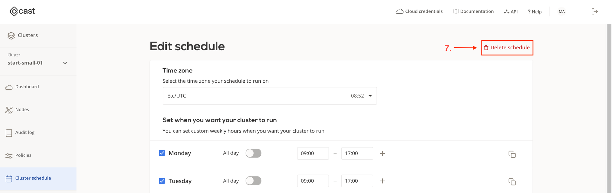

# Cluster schedule

Control when your cluster should be running to match your specific needs. Clusters can be paused and resumed during your predefined time periods in order to save resources and money. By default there is no schedule set on your cluster.

Key functionality:

1. Time zone selector. Select a time zone (default time zone is set the same as on your machine)
2. Select the weekdays when you wish to run your cluster based on a schedule, during other weekdays cluster will be in a paused state.
3. Set active time for your cluster based on:
    - Weekday
    - Time period in the day. Multiple time intervals can be set in a single day to cater for custom work patters, breaks etc.
    - Cluster can be set to be always “ON”  (i.e. 24hrs).
4. Copy schedule set in one day to one or more other weekdays.
5. Check estimated savings to understand how much you can save if schedule (as defined) will be applied on a cluster.
6. Save schedule. Cluster will be paused and resumed based on values entered.
7. Delete schedule (only available if schedule was set to begin with). Cluster will have no schedule applied and will be active 24/7.

