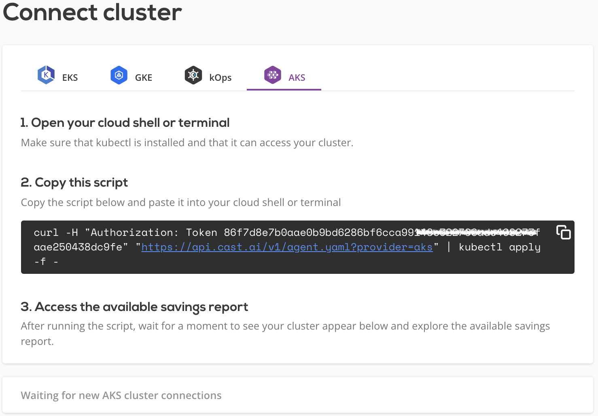
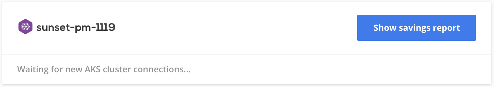
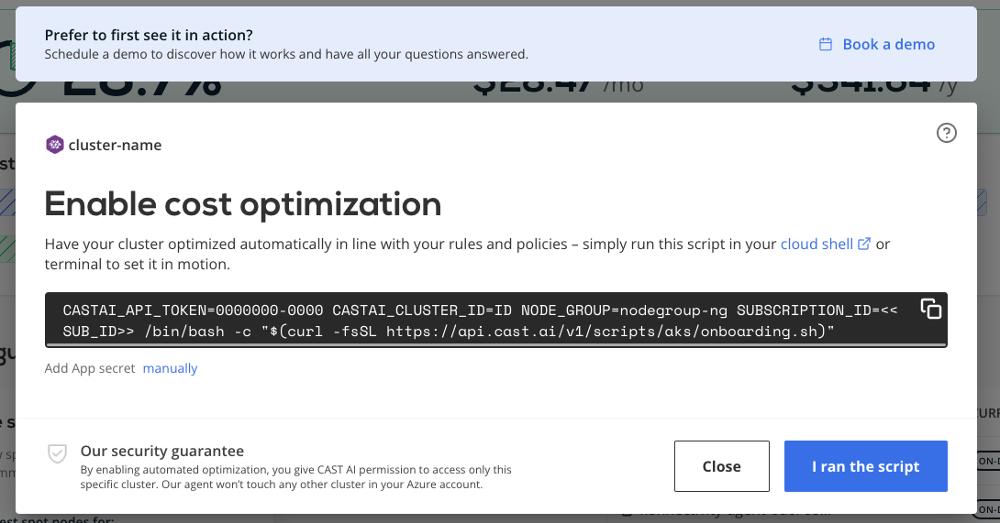

# Azure AKS

## Connect cluster

To connect your cluster, [log in to the CAST AI console](https://console.cast.ai/external-clusters/new) and navigate to **Connect cluster** window, [**AKS**](https://console.cast.ai/external-clusters/new#aks) tab. Copy the provided script and run it in your terminal or cloud shell. Make sure that kubectl is installed and can access your cluster.



The script will create following kubernetes objects related to `castai-agent` agent:

- namespace and deployment
- serviceaccount and secret
- clusterrole and clusterrolebinding
- role and rolebinding
- resourcequota
- configmap

After installation, your cluster name will appear below connection instructions as well as in the **Cluster list**. From there, you can open the cluster details and explore a detailed savings estimate based on your cluster configuration.



!!! note ""
    The agent will run in a read-only mode, providing savings suggestions without applying any actual modifications.

## Credential onboarding

To unlock all the benefits and enable automated cost optimization, CAST AI needs to have access to your cluster. The following
section describes the steps required to onboard the AKS cluster on the CAST AI console. To make it less troublesome, we created
a script that automates most of the steps.

Prerequisites:

- `az CLI` - A command line tool for working with Azure services using commands in your command-line shell. For more
  information, see [Installing az CLI](https://learn.microsoft.com/en-us/cli/azure/install-azure-cli).

- `jq` – a lightweight command line JSON processor. For more information about the tool click [here](https://stedolan.github.io/jq/).

- *Azure AD* permissions – permissions to create App registration

- The CAST AI agent has to be running on the cluster.

Onboarding steps:

To onboard your cluster, go to the **Available Savings** report and click on the **Start saving** or **Enable optimization** button.



That’s it! Your cluster is onboarded. Now you can enable CAST AI [Autoscaler](../../product-overview/console/autoscaler.md) to keep your cluster configuration optimal.

!!! note ""
   Due to various reasons it sometime takes longer to validate the Azure credentials. Multiple re-runs of the onboarding script are required.  

## Actions performed by the onboarding script

The script will perform the following actions:

- Create `CASTAKSRole-*cluster-id*` role used to manged onboarded AKS Cluster which following permissions

```shell
ROLE_NAME="CastAKSRole-${CASTAI_CLUSTER_ID:0:8}"
ROLE_DEF='{
   "Name": "'"$ROLE_NAME"'",
   "Description": "CAST.AI role used to manage '"$CLUSTER_NAME"' AKS cluster",
   "IsCustom": true,
   "Actions": [
       "Microsoft.Compute/*/read",
       "Microsoft.Compute/virtualMachines/*",
       "Microsoft.Compute/virtualMachineScaleSets/*",
       "Microsoft.Compute/disks/write",
       "Microsoft.Compute/disks/delete",
       "Microsoft.Network/*/read",
       "Microsoft.Network/networkInterfaces/write",
       "Microsoft.Network/networkInterfaces/delete",
       "Microsoft.Network/networkInterfaces/join/action",
       "Microsoft.Network/networkSecurityGroups/join/action",
       "Microsoft.Network/publicIPAddresses/write",
       "Microsoft.Network/publicIPAddresses/delete",
       "Microsoft.Network/publicIPAddresses/join/action",
       "Microsoft.Network/virtualNetworks/subnets/join/action",
       "Microsoft.Network/virtualNetworks/subnets/write",
       "Microsoft.Network/applicationGateways/backendhealth/action",
       "Microsoft.Network/applicationGateways/backendAddressPools/join/action",
       "Microsoft.Network/applicationSecurityGroups/joinIpConfiguration/action",
       "Microsoft.Network/loadBalancers/backendAddressPools/write",
       "Microsoft.Network/loadBalancers/backendAddressPools/join/action",
       "Microsoft.ContainerService/*/read",
       "Microsoft.ContainerService/managedClusters/start/action",
       "Microsoft.ContainerService/managedClusters/stop/action",
       "Microsoft.ContainerService/managedClusters/runCommand/action",
       "Microsoft.ContainerService/managedClusters/agentPools/*",
       "Microsoft.Resources/*/read",
       "Microsoft.Resources/tags/write",
       "Microsoft.Authorization/roleAssignments/read",
       "Microsoft.Authorization/roleDefinitions/read",
       "Microsoft.ManagedIdentity/userAssignedIdentities/assign/action"
     ],
     "AssignableScopes": [
       "/subscriptions/'"$SUBSCRIPTION_ID"'/resourceGroups/'"$CLUSTER_GROUP"'",
       "/subscriptions/'"$SUBSCRIPTION_ID"'/resourceGroups/'"$NODE_GROUP"'"
     ]
}'
```

- Create app registration `CAST.AI ${CLUSTER_NAME}-${CASTAI_CLUSTER_ID:0:8}"` which uses role `CastAKSRole-${CASTAI_CLUSTER_ID:0:8}`

!!! note ""
    All the `Write` permissions are scoped to a resource groups in which the cluster is running - it won't have access to resources of any other clusters in the Azure subscription.

Kubernetes components required for a successful experience with CAST AI

```shell
$ kubectl get deployments.apps   -n castai-agent
NAME                        READY   UP-TO-DATE   AVAILABLE   AGE
castai-agent                1/1     1            1           3h26m
castai-agent-cpvpa          1/1     1            1           3h26m
castai-cluster-controller   2/2     2            2           3h26m
castai-evictor              0/0     0            0           3h26m
$ kubectl get daemonsets.apps -n castai-agent
NAME                   DESIRED   CURRENT   READY   UP-TO-DATE   AVAILABLE   NODE SELECTOR                            AGE
castai-aks-init-data   0         0         0       0            0           provisioner.cast.ai/aks-init-data=true   3h26m
castai-spot-handler    0         0         0       0            0           scheduling.cast.ai/spot=true             3h26m
```

Full overview of hosted components can be found [here](../../product-overview/hosted-components.md)
