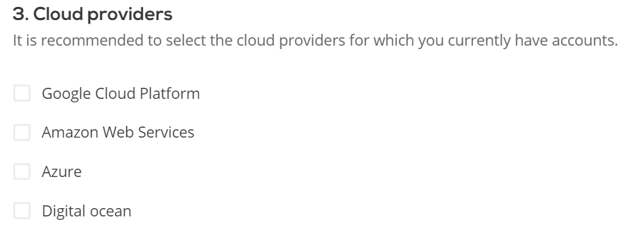
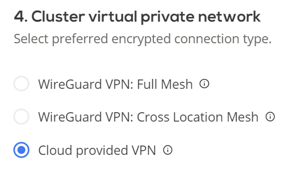

# 2. Create cluster

Once you [add cloud credentials](../getting-started/credentials/credentials-overview.md) - you are ready to create a cluster. In the cluster creation window you will have a few options to lay a base foundation for your cluster, which we will be able to further customize to your needs once a cluster is up and running.

## Cluster details

The new cluster will be created with the name and in the region, you specify here.
After the cluster is created, name and region cannot be changed.

- Name your cluster (2-50 symbols, only letters, numbers, and hyphens allowed)

- Select a region where your cluster will be located

## Cluster configuration

Select initial cluster configuration. It may be automatically adjusted based on scaling and cost optimization policies. You will be able to adjust policies once the cluster is created. You may also manually add nodes once the cluster is provisioned.

## Cloud providers

Select the cloud provider(s) you would like to use for this cluster. You will need to select credentials that you would like to use for each provider, please refer to [1. Add cloud credentials](../getting-started/credentials/credentials-overview.md) section if you have no credentials added.

## Cluster virtual private network

Select preferred encrypted connection type. Cloud provided VPN is a default VPN provided by the respective cloud service providers.

!!! tip ""
    WireGuard is a CAST AI integrated choice of VPN that cuts cloud cost.

- WireGuard VPN: Full Mesh - network traffic is encrypted between all nodes
- WireGuard VPN: Cross Location Mesh - network traffic is encrypted only between nodes in different clouds
- Cloud provided VPN - default network encryption provided by selected CSPs

Also see - [VPN overview](../concepts/vpn-overview.md)

!!! tip ""
    Next step: [deploy application](../getting-started/deploy-application.md)
