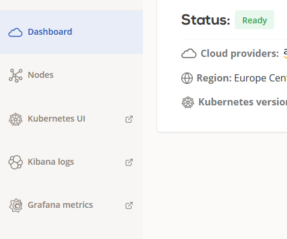
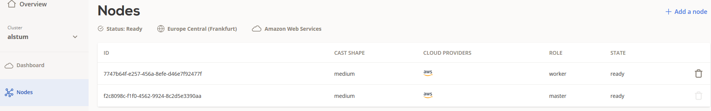

# Creating your first cluster
This guide covers very basics of creating your first Kubernetes cluster on Cast AI.
## Setting up cloud credentials

Before you're able to create your first cluster, you'll need to provide Cast AI access to your cloud accounts. Our platform will perform actions on your cloud account, like setting up network, security groups, creating VMs and Kubernetes cluster itself.

You'll need at least one set of credentials per each cloud you want to use in your multicloud cluster.

View, add and delete credentials in console on [Cloud Credentials](https://console.cast.ai/cloud-credentials) list; you can also add new credentials directly while [creating a new cluster](https://console.cast.ai/clusters:new).

## Creating cluster

Start by logging into your account. You can create a new cluster by clicking on **Create a cluster** button in Cast AI console:

At this point, we will ask you to enter your cluster name and select its region of multi-cloud providers. Make sure that the cluster name starts with a letter and use hyphens between the letters (no numbers or other characters are allowed).

Now you can select your preferred cluster configuration. Note that this is just an initial configuration and it will be adjusted by the scaling and cost optimization policies.

The last step is to select a cloud provider and give CAST AI permission to manage your cluster automatically.

Click on one of these links to get your key adding instructions for:

* [GCP](https://castai.github.io/docs/administration/configuring-gcp-credentials/)

* [AZURE](https://castai.github.io/docs/administration/configuring-azure-credentials/)

* [AWS](https://castai.github.io/docs/administration/configuring-aws-credentials/)

After finishing this step, simply click on this button and wait a few minutes for the cluster to initialize.

## Inspecting created cluster

After the cluster is started, you will get access to your own metrics and information like: 

* Kubernetes UI
* Kibana Logs
* Grafana metrics

You can also inspect the cluster nodes in Cast AI console:

When checking Grafana, make sure to click on top left **Menu** to open up your **Kubernetes cluster** and **NGINX ingress controller** metrics.

**Note** if you cannot access these metrics right after the cluster is in ready state, give it a minute or two and try again.
