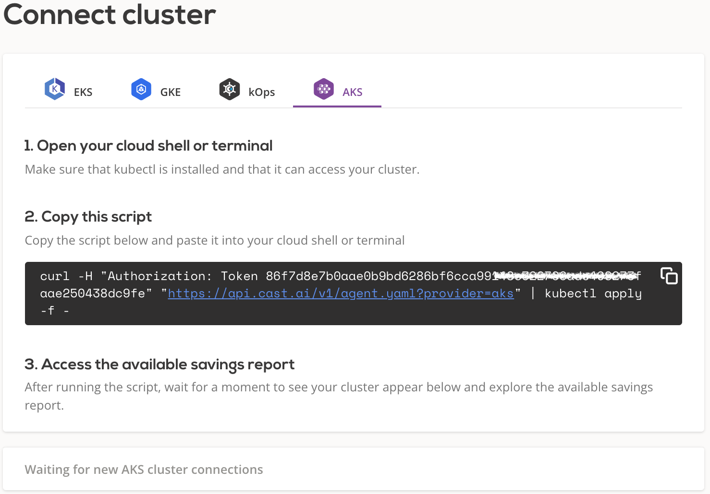
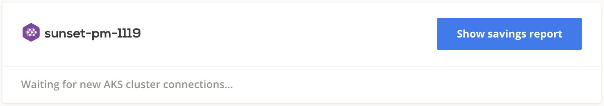

# Azure AKS

## Connect cluster

To connect your cluster, [log in to the CAST AI console](https://console.cast.ai/external-clusters/new) and navigate to **Connect cluster** window, [**AKS**](https://console.cast.ai/external-clusters/new#aks) tab. Copy the provided script and run it in your terminal or cloud shell. Make sure that kubectl is installed and can access your cluster.

The script will create following kubernetes objects related to `castai-agent` agent:

- namespace and deployment
- serviceaccount and secret
- clusterrole and clusterrolebinding
- role and rolebinding
- resourcequota
- configmap

After installation, your cluster name will appear below connection instructions as well as in the **Cluster list**. From there, you can open the cluster details and explore a detailed savings estimate based on your cluster configuration.

!!! note ""
    The agent will run in a read-only mode, providing savings suggestions without applying any actual modifications.
