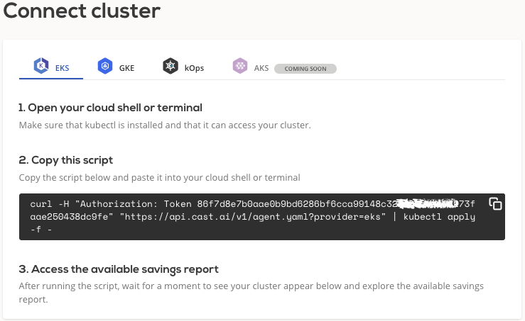

# AWS EKS

## Connect cluster

To connect your EKS cluster, login to the CAST console and navigate to the `Connect cluster` window. Copy the following script
and run it your terminal or cloud shell. Make sure that kubectl is installed and can access your cluster.



After installation, your EKS cluster should appear in the cluster list. From there, you can open cluster details and explore
a detailed savings estimate based on your cluster configuration.


!!! note ""
    Agent will run in read-only mode providing saving suggestions without any actual modifications.

## Credential onboarding

To unlock all the benefits and enable automatic cost optimization, CAST AI must have access to your cluster. The following
section will describe the steps required to onboard the EKS cluster on the CAST AI console. To make it less troublesome, we have created
script that automates most of the steps.

Prerequisites:

- `AWS CLI` - A command line tool for working with AWS services using commands in your command-line shell. For more
  information, see [Installing AWS CLI](https://docs.aws.amazon.com/cli/latest/userguide/install-cliv2.html).

- `eksctl` – A command line tool for working with EKS clusters that automates many individual tasks. This guide requires
  that you use version 0.43.0 or later. For more information,
  see [The eksctl command line utility](https://docs.aws.amazon.com/eks/latest/userguide/eksctl.html).

- **IAM permissions** – The IAM security principal that you're using must have permissions to work with AWS EKS, AWS IAM,
  and related resources. Additionally, you should have access to the EKS cluster that you wish to onboard on the CAST AI console.

When you create an Amazon EKS cluster, the IAM entity user or role, such as a federated user that creates the cluster,
is automatically granted a `system:masters` permissions in the cluster's RBAC configuration in the control plane. To grant
additional AWS users or roles the ability to interact with your cluster, you must edit the `aws-auth` ConfigMap within
Kubernetes. For more information,
see [Managing users or IAM roles for your cluster](https://docs.aws.amazon.com/eks/latest/userguide/add-user-role.html)

Run the following script to reduce number of manual steps mentioned above.

```bash
REGION=<region> CLUSTER_NAME=<name> /bin/bash -c "$(curl -fsSL https://raw.githubusercontent.com/castai/docs/main/docs/getting-started/credentials/configuring-eks-credentials/script.sh)"
```

It will create a new AWS user with the required permissions, modify `aws-auth` ConfigMap, and print AWS `AccessKeyId`
and `SecretAccessKey`, which then can be added to the CAST AI console and assigned to the corresponding EKS cluster.

Generated user will have following permissions:

- `AmazonEC2ReadOnlyAccess`
- `IAMReadOnlyAccess`
- Manage instances in specified cluster restricted to cluster VPC
- Manage autoscaling groups in specified cluster
- Manage EKS Node Groups in specified cluster

!!! note ""
    All `Write` permissions are scoped to single EKS cluster, and it won't have access to resources of other clusters in the AWS account.