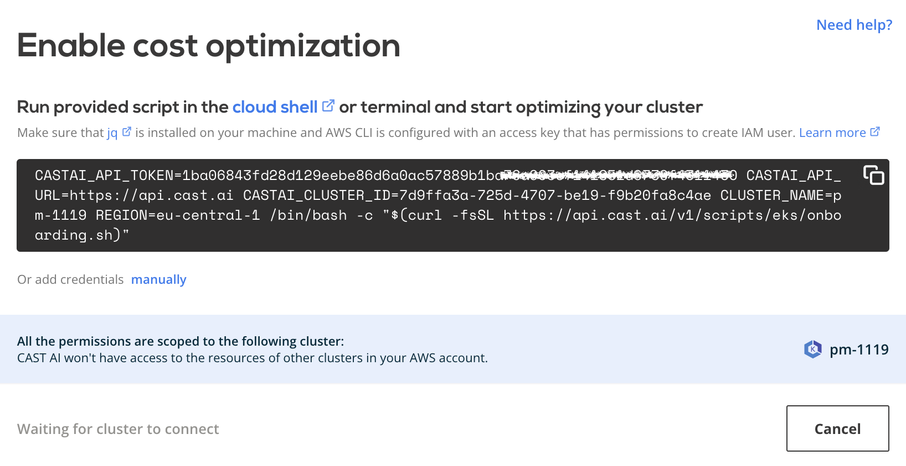

# AWS EKS

## Connect cluster

To connect your cluster, [login to the CAST AI console](https://console.cast.ai/external-clusters/new) and navigate to **Connect cluster** window, [**EKS**](https://console.cast.ai/external-clusters/new#eks) tab. Copy the provided script and run it in your terminal or cloud shell. Make sure that kubectl is installed and can access your cluster.

Script will create `castai-agent` namespace and deployment. After installation, your cluster should appear in the **Cluster list**. From there, you can open the cluster details and explore
detailed savings estimate based on your cluster configuration.

!!! note ""
    The agent will run in read-only mode, providing savings suggestions without applying any actual modifications.

## Credential onboarding

To unlock all the benefits and enable automatic cost optimization, CAST AI must have access to your cluster. The following
section describes the steps required to onboard the EKS cluster on the CAST AI console. To make it less troublesome, we have created
a script that automates most of the steps.

Prerequisites:

- `AWS CLI` - A command line tool for working with AWS services using commands in your command-line shell. For more
  information, see [Installing AWS CLI](https://docs.aws.amazon.com/cli/latest/userguide/install-cliv2.html).

- `eksctl` – A command line tool for working with EKS clusters that automates many individual tasks. This guide requires
  that you use version 0.43.0 or later. For more information,
  see [The eksctl command line utility](https://docs.aws.amazon.com/eks/latest/userguide/eksctl.html).

- **IAM permissions** – The IAM security principal that you're using must have permissions to work with AWS EKS, AWS IAM,
  and related resources. Additionally, you should have access to the EKS cluster that you wish to onboard on the CAST AI console.

- The CAST AI agent has to be running on the cluster.

Onboarding steps:

To onboard your cluster, go to the **Available Savings** report and click on the **Start saving** or **Enable CAST AI** button. The button's name will depend on the number of optimizations available from your cluster.

Follow the instruction in the pop-up window to create and use AWS `AccessKeyId` and `SecretAccessKey`

The script will create a new AWS user with the required permissions, modify `aws-auth` ConfigMap, and print AWS `AccessKeyId` and `SecretAccessKey`, which then can be added to the CAST AI console and assigned to the corresponding EKS cluster.

The generated user will have the following permissions:

- `AmazonEC2ReadOnlyAccess`
- `IAMReadOnlyAccess`
- Manage instances in specified cluster restricted to cluster VPC
- Manage autoscaling groups in the specified cluster
- Manage EKS Node Groups in the specified cluster

All the `Write` permissions are scoped to a single EKS cluster - it won't have access to resources of any other clusters in the AWS account.

That’s it! Your cluster is onboarded. You can now enable [policies](https://docs.cast.ai/console-overview/policies/) to keep your cluster configuration optimal.

To complete the steps mentioned above manually (without our script), be aware that when you create an Amazon EKS cluster, the IAM entity user or role (such as a federated user that creates the cluster) is automatically granted a `system:masters` permissions in the cluster's RBAC configuration in the control plane. To grant additional AWS users or roles the ability to interact with your cluster, you need to edit the `aws-auth` ConfigMap within Kubernetes. For more information, see [Managing users or IAM roles for your cluster](https://docs.aws.amazon.com/eks/latest/userguide/add-user-role.html).

[Connect your cluster here](https://console.cast.ai/external-clusters/new#eks)
