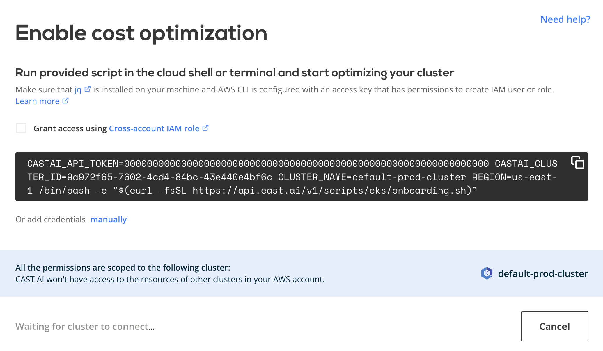

# AWS EKS

## Connect cluster

To connect your cluster, [log into the CAST AI console](https://console.cast.ai/external-clusters/new) and navigate to the **Connect cluster** window, [**EKS**](https://console.cast.ai/external-clusters/new#eks) tab. Copy the provided script and run it in your terminal or cloud shell. Make sure that kubectl is installed and can access your cluster.

The script will create the following Kubernetes objects related to the `castai-agent` agent:

- namespace and deployment
- serviceaccount and secret
- clusterrole and clusterrolebinding
- role and rolebinding
- resourcequota
- configmap

After installation, your cluster name will appear below connection instructions as well as in the **Cluster list**. From there, you can open the cluster details and explore a detailed savings estimate based on your cluster configuration.

!!! note ""
    The agent will run in a read-only mode, providing savings suggestions without applying any modifications.

## Credential onboarding

To unlock all the benefits and enable automated cost optimization, CAST AI needs to have access to your cluster. The following
section describes the steps required to onboard the EKS cluster on the CAST AI console. To make it less troublesome, we created
a script that automates most of the steps.

Prerequisites:

- `AWS CLI` - A command line tool for working with AWS services using commands in your command-line shell. For more
  information, see [Installing AWS CLI](https://docs.aws.amazon.com/cli/latest/userguide/install-cliv2.html).

- `jq` – a lightweight command line JSON processor. For more information about the tool click [here](https://stedolan.github.io/jq/).

- **IAM permissions** – The IAM security principal that you're using must have permissions to work with AWS EKS, AWS IAM,
  and related resources. Additionally, you should have access to the EKS cluster that you wish to onboard on the CAST AI console.

- The CAST AI agent has to be running on the cluster.

Onboarding steps:

To onboard your cluster, go to the **Available Savings** report and click on the **Start saving** or **Enable CAST AI** button.

The following pop-up window contains the instructions for providing CAST AI with AWS access. By default, the script will create a `AccessKeyId` and `SecretAccessKey`. 

If `Use cross-role IAM` checkbox is selected, the script will create a role in your AWS account, with a trust policy to a CAST AI AWS user, allowing access through the STS AssumeRole API.

That’s it! Your cluster is onboarded. Now you can enable CAST AI [Autoscaler](../../../product-overview/console/autoscaler.md) to keep your cluster configuration optimal.

## Actions performed by the onboarding script

The script will perform the following actions:

- Create `cast-eks-*cluster-name*` IAM user (if cross-account Role IAM is selected, an IAM role is created instead), with the required permissions to manage the cluster:
    - `AmazonEC2ReadOnlyAccess`
    - `IAMReadOnlyAccess`
    - Manage instances in specified cluster restricted to cluster VPC
    - Manage autoscaling groups in the specified cluster
    - Manage EKS Node Groups in the specified cluster

- Create `CastEKSPolicy` policy used to manage EKS cluster. The policy contains the following permissions:
    - Create & delete instance profiles
    - Create & manage roles
    - Create & manage EC2 security groups, key pairs, and tags
    - Run EC2 instances
    - Create and manage the lambda function

- Create following roles:
    - `cast-*cluster-name*-eks-#######` to manage EKS nodes with following AWS managed permission policies applied :
        - AmazonEKSWorkerNodePolicy
        - AmazonEC2ContainterRegistryReadOnly
        - AmazonEKS_CNI_Policy

    - `CastLambdaRoleForSpot` a lambda role used to manage Spot interruption events with following AWS managed permission policies applied:
        - CloudWatchLogsFullAccess
        - AWSLambdaRole
        - AmazonEC2ReadOnlyAccess

- Modify `aws-auth` ConfigMap to map newly created IAM user to the cluster (skipped in case of cross-role IAM)
- If a cross-account role IAM was not selected, AWS `AccessKeyId` and `SecretAccessKey` are created and printed, which then can be added to the CAST AI console and assigned to the corresponding EKS cluster. The `AccessKeyId` and `SecretAccessKey`are used to by CAST to make programmatic calls to AWS and are stored in CAST AI's secret store that runs on [Google's Secret manager solution](https://cloud.google.com/secret-manager).
- With cross-account role IAM selected, a Role ARN is printed and sent to CAST AI console, which is then used by CAST AI to assume the role when making AWS programmatic calls.

!!! note ""
    All the `Write` permissions are scoped to a single EKS cluster - it won't have access to resources of any other clusters in the AWS account.

## Manual credential onboarding

To complete the steps mentioned above manually (without our script), be aware that when you create an Amazon EKS cluster, the IAM entity user or role (such as a federated user that creates the cluster) is automatically granted a `system:masters` permissions in the cluster's RBAC configuration in the control plane. To grant additional AWS users or roles the ability to interact with your cluster, you need to edit the `aws-auth` ConfigMap within Kubernetes. For more information, see [Managing users or IAM roles for your cluster](https://docs.aws.amazon.com/eks/latest/userguide/add-user-role.html).

## Usage of AWS services

CAST AI relies on the agent runs inside customer's cluster. The following services are consumed during the operation:

- A portion of EC2 node resources from the customer's cluster. The CAST AI agent uses [Cluster proportional vertical autoscaler](https://github.com/kubernetes-sigs/cluster-proportional-vertical-autoscaler#calculation-of-resource-requests-and-limits) to consume a minimum required resources depending on the size of the cluster
- Low amount of network traffic to communicate with CAST AI SaaS
- Lambda function to handle Spot Instance interruptions
- EC2 instances, their storage, and intra-cluster network traffic to manage Kubernetes cluster and perform autoscaling
- IAM resources as detailed in the [onboarding section](#actions-performed-by-the-onboarding-script)
