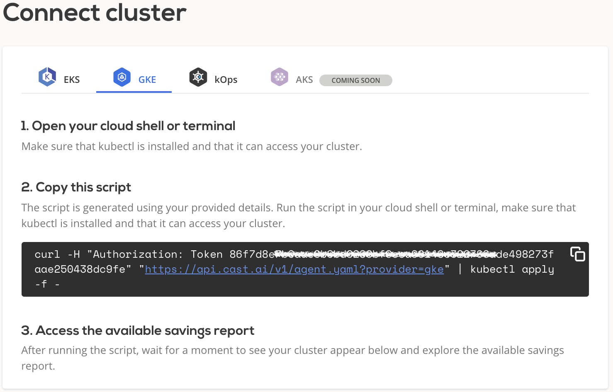
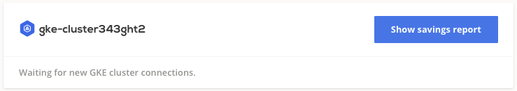

# GCP GKE

## Connect cluster

To connect your cluster, [login to the CAST AI console](https://console.cast.ai/external-clusters/new) and navigate to **Connect cluster** window, [**GKE**](https://console.cast.ai/external-clusters/new#gke) tab. Follow the instructions in order to provide the required details.

Once all details about your cluster are entered, generation of the onboarding script will be completed. Copy the script and run it your terminal or cloud shell. Make sure that kubectl is installed and can access your cluster.



Script will create `castai-agent` namespace and deployment. After the installation, your cluster should appear at the bottom of the screen as well as in the **Clusters** list.



From there, you can open **Available savings** report and explore detailed savings estimate based on your cluster configuration.

!!! note ""
    Agent will run in read-only mode providing saving suggestions without any actual modifications.

## Disconnect GKE cluster

In order to disconnect your cluster from CAST AI click **Disconnect cluster** button in **Clusters** list and follow the guidance.  Alternatively run following command from your terminal used to access the cluster:

```bash
kubectl delete deployment castai-agent -n castai-agent
```

Once cluster is disconnected its `Status` will change to `Disconnected` and you can choose to remove it from console by pressing **Delete cluster** button.

!!! note ""
    Cluster will continue to run as normal, since **Delete cluster** action only removes it from CAST AI console.
