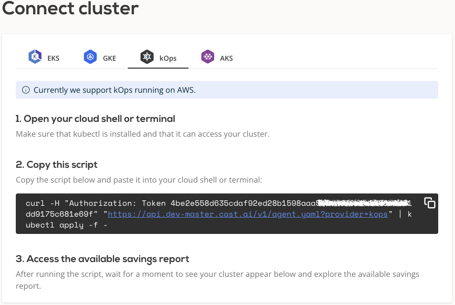
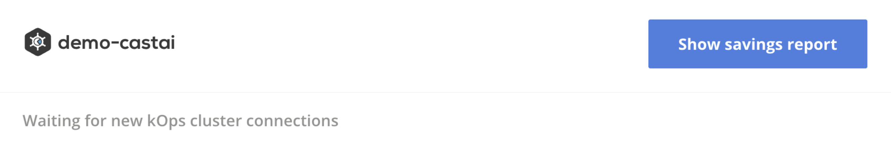
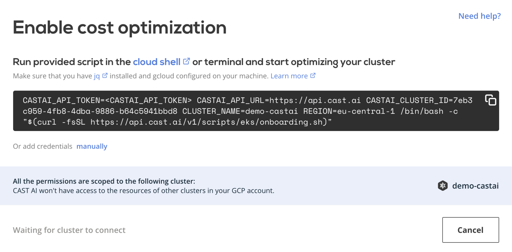

# kOps

Currently CAST AI supports only kOps clusters running on AWS.

## Connect cluster

To connect your cluster, [log in to the CAST AI console](https://console.cast.ai/external-clusters/new) and navigate to **Connect cluster** window, [**kOps**](https://console.cast.ai/external-clusters/new#kops) tab. Copy the provided script and run it in your terminal or cloud shell. Make sure that kubectl is installed and can access your cluster.



The script will create following kubernetes objects related to `castai-agent` agent:

- namespace and deployment
- serviceaccount and secret
- clusterrole and clusterrolebinding
- role and rolebinding
- resourcequota
- configmap

After installation, your cluster name will appear below connection instructions as well as in the **Cluster list**. From there, you can open the cluster details and explore a detailed savings estimate based on your cluster configuration.



!!! note ""
    The agent will run in a read-only mode, providing savings suggestions without applying any actual modifications.

## Credential onboarding

To unlock all the benefits and enable automatic cost optimization, CAST AI needs to have access to your cluster. The following
section describes the steps required to onboard the kOps cluster on the CAST AI console. To make it less troublesome, we created
a script that automates most of the steps.

Prerequisites:

- `AWS CLI` - A command line tool for working with AWS services using commands in your command-line shell. For more
  information, see [Installing AWS CLI](https://docs.aws.amazon.com/cli/latest/userguide/install-cliv2.html).

- `jq` – a lightweight command line JSON processor. For more information about the tool click [here](https://stedolan.github.io/jq/).

- **IAM permissions** – The IAM security principal that you're using must have permissions to work with AWS IAM,
  and related resources. Additionally, you should have access to the kOps cluster that you wish to onboard on the CAST AI console.

- The CAST AI agent has to be running on the cluster.

Onboarding steps:

To onboard your cluster, go to the **Available Savings** report and click on the **Start saving** or **Enable CAST AI** button. The button's name will depend on the number of optimizations available from your cluster.

Follow the instruction in the pop-up window to create and use AWS `AccessKeyId` and `SecretAccessKey`



That’s it! Your cluster is onboarded. Now you can enable CAST AI [Autoscaler](/product-overview/console/autoscaler) to keep your cluster configuration optimal.

## Actions performed by the onboarding script

The script will perform the following actions:

- Create `cast-kops-*cluster-name*` IAM user with the required permissions to manage the cluster:
    - `AmazonEC2ReadOnlyAccess`
    - `IAMReadOnlyAccess`
    - Manage instances in specified cluster restricted to cluster VPC
    - Manage autoscaling groups in the specified cluster
    - Manage EC2 Node Groups in the specified cluster

- Create `CASTKopsPolicyV2` managed policy used to manage kOps cluster. The policy contains the following permissions:
    - Create & delete instance profiles
    - Create & manage roles
    - Create & manage EC2 security groups, key pairs, and tags
    - Run EC2 instances
    - Create and manage the lambda function

- Create `CASTKopsRestrictedaccess` inline policy to manage cluster specific resources.

- Create `CastLambdaRoleForSpot` role used to manage Spot interruption events with following AWS managed permission policies applied:
    - CloudWatchLogsFullAccess
    - AWSLambdaRole
    - AmazonEC2ReadOnlyAccess

- Modify `aws-auth` ConfigMap to map newly created IAM user to the cluster
- Create and print AWS `AccessKeyId` and `SecretAccessKey`, which then can be added to the CAST AI console and assigned to the corresponding kOps cluster. The `AccessKeyId` and `SecretAccessKey`are used to by CAST to make programmatic calls to AWS and are stored in CAST AI's secret store that runs on [Google's Secret manager solution](https://cloud.google.com/secret-manager).

!!! note ""
    All the `Write` permissions are scoped to a single kOps cluster - it won't have access to resources of any other clusters in the AWS account.

## Manual credential onboarding

To complete the steps mentioned above manually (without our script), be aware that when you create a cluster, the IAM entity user or role (such as a federated user that creates the cluster) is automatically granted a `system:masters` permissions in the cluster's RBAC configuration in the control plane. To grant additional AWS users or roles the ability to interact with your cluster, you need to edit the `aws-auth` ConfigMap within Kubernetes. For more information, see [Managing users or IAM roles for your cluster](https://docs.aws.amazon.com/eks/latest/userguide/add-user-role.html).

## Usage of AWS services

CAST AI relies on the agent runs inside customer's cluster. The following services are consumed during the operation:

- A portion of EC2 node resources from the customer's cluster. The CAST AI agent uses [Cluster proportional vertical autoscaler](https://github.com/kubernetes-sigs/cluster-proportional-vertical-autoscaler#calculation-of-resource-requests-and-limits) to consume a minimum required resources depending on the size of the cluster
- Low amount of network traffic to communicate with CAST AI SaaS
- Lambda function to handle Spot Instance interruptions
- EC2 instances, their storage, and intra-cluster network traffic to manage Kubernetes cluster and perform autoscaling
- IAM resources as detailed in the [onboarding section](#actions-performed-by-the-onboarding-script)

## Known issues

### Custom taints on kOps v1.17 with kube-router

  There's a known [issue](https://github.com/kubernetes/kops/issues/9530) on kOps v1.17.
  Nodes with custom taints are not able to join the cluster when cluster is used with `kube-router` networking component.
  This happens because `kube-router` doesn't have required tolerations to start on nodes with custom taints.
  
  **Impact:** CAST.AI won't be able to add any nodes with custom taints (ex. Spot) for impacted clusters.
  
  **Resolution:** add following tolerations to `kube-router` daemonSet in your kOps v1.17 cluster's `kube-system` namespace.

  ````
  tolerations:
    - effect: NoSchedule
      operator: Exists
    - effect: NoExecute
      operator: Exists
    - key: CriticalAddonsOnly
      operator: Exists
  ````
