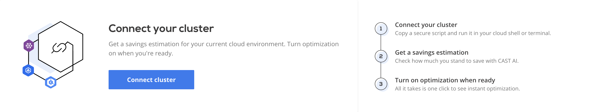

# External Cluster Overview

External cluster management brings CAST AI features like autoscaler to externally-managed clusters on EKS, GKE
or AKS. By installing the [CAST AI agent](https://github.com/castai/k8s-agent), you can start observing the running costs and potential savings of your cluster - and then enable the features that optimize your cluster - like adding and removing nodes or rightsizing deployments.

To get started, log into the console and navigate to the **Connect cluster** window.

The script will install the agent that will run inside the cluster in read-only mode. After the installation, the agent will collect and analyze your cluster configuration to provide the most optimal setup along with a savings estimation for your current cloud environment.

To start saving costs, turn the automatic optimization on when you're ready.

Connect your cluster:

- [AWS EKS](./eks/eks.md)
- [GCP GKE](./gke/gke.md)
- [Azure AKS](./aks/aks.md)
- [kOps](./kops/kops.md)
