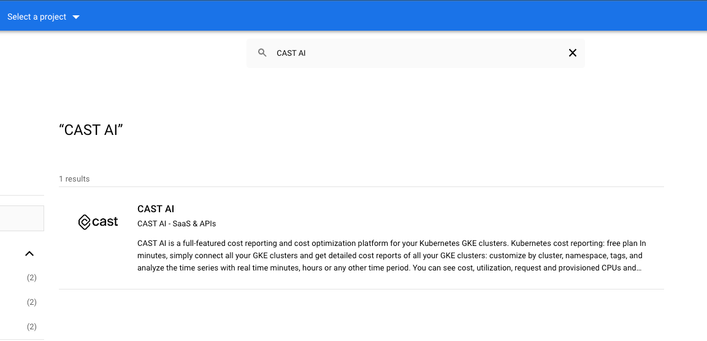
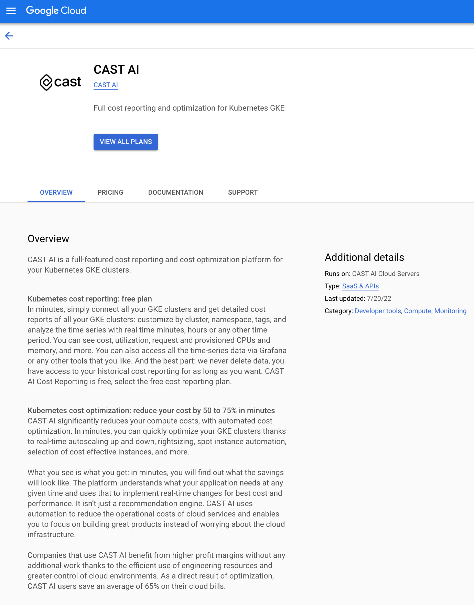
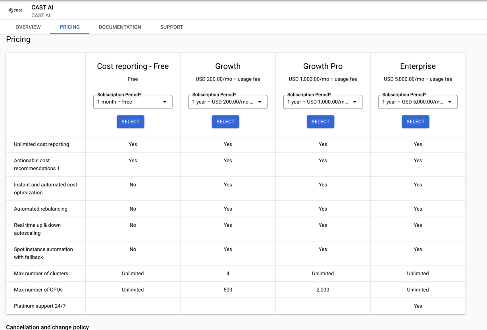
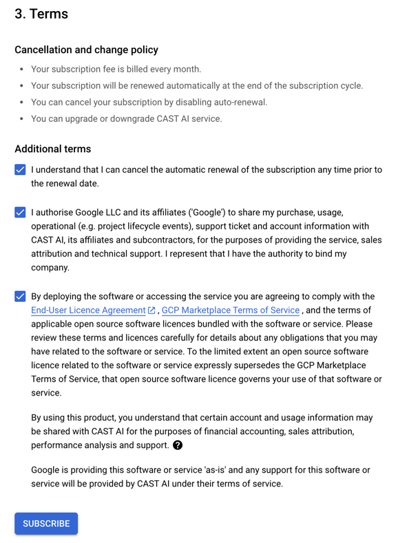
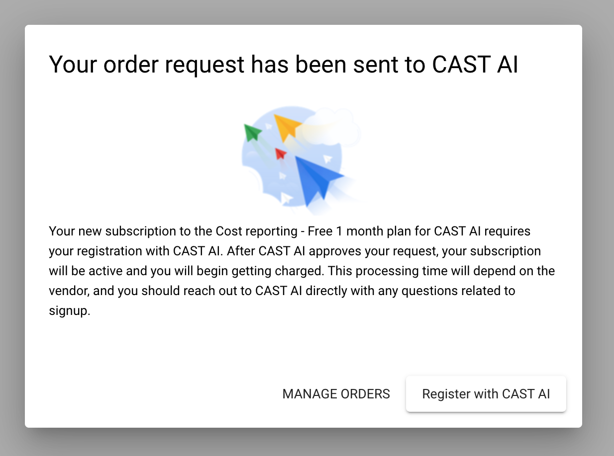
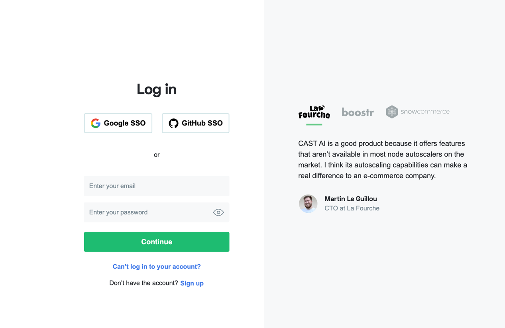
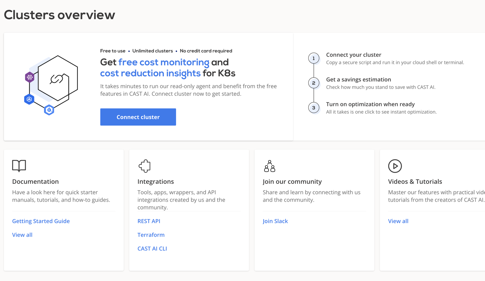
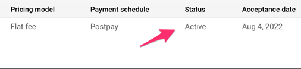

# How to start CAST AI cloud cost management platform on Google Cloud Marketplace

The CAST AI platform is now available on the Google Cloud Marketplace. Using the new integration, customers can now access CAST AI directly from their cloud provider, eliminating the need to sign a new contract and taking advantage of their existing Google Cloud credits. 

Like other products available on the Google Cloud Marketplace, CAST AI meets Google’s security and solution design requirements.

How do you get started? Follow this step-by-step guide to access CAST AI from Google Cloud Marketplace.

## Requirements

To onboard CAST AI using Google Cloud Marketplace, you need to have the following:
* access to Google Cloud Marketplace in your GCP project (with the rights to purchase solutions from the marketplace);
* access to CAST AI console.

## Finding the CAST AI offering in Google Marketplace

Navigate to the Google Marketplace website and search for CAST AI. You can also use this [link](https://console.cloud.google.com/marketplace/product/castai-public/cast-ai?).

This is the CAST AI offering:

## Subscribing to CAST AI in GCP Marketplace

Choose your plan and click SELECT.

Agree to our terms of service and Subscribe. Before doing so, please make sure that your browser accepts popups from the Google Cloud Marketplace site.

## Registration in CAST AI console

The next step is registration inside the CAST AI console page. You need to click **Register with CAST AI**.

After that, you should be redirected to the CAST AI console, where you need to log in to the organization to which the Google Marketplace subscription is assigned.

Normal CAST AI login screen:

Cluster view after successful login:

## Validation

After completing all of the steps above, your CAST AI subscription should be in an active state.

## Quick guide to CAST AI pricing

Users can choose from four different pricing plans on Google Cloud Marketplace: Cost reporting (free of charge and great to get started), Growth, Growth Pro, and Enterprise.

**Cost reporting - Free**

This is a free plan that lasts 1 month. It gives you real-time cost monitoring and reporting features, covering both current and historical cost data. You also get cost optimization recommendations to implement manually.

**Growth - USD 200.00/mo + usage fee**

This plan gives you access to cost monitoring and automated cost optimization powered by features such as automated [rebalancing](https://docs.cast.ai/product-overview/rebalancing/), real-time [autoscaling](https://docs.cast.ai/product-overview/autoscaler/), and [spot instance automation](https://docs.cast.ai/guides/spot/) with fallback. There’s a limit on cluster number and CPU.  

**Growth Pro - 1 year – USD 200.00/mo + usage fee**
  
This plan gives you all the features of the Growth plan without any limits around cluster number. There is a limit on CPUs.

**Enterprise - USD 5,000.00/mo + usage fee**

You get all of the cost monitoring and automated cost optimization features with no limits, with Platinum 24/7 support.We provide custom offers where monthly fee and tiered based pricing are subject to negotiation.
