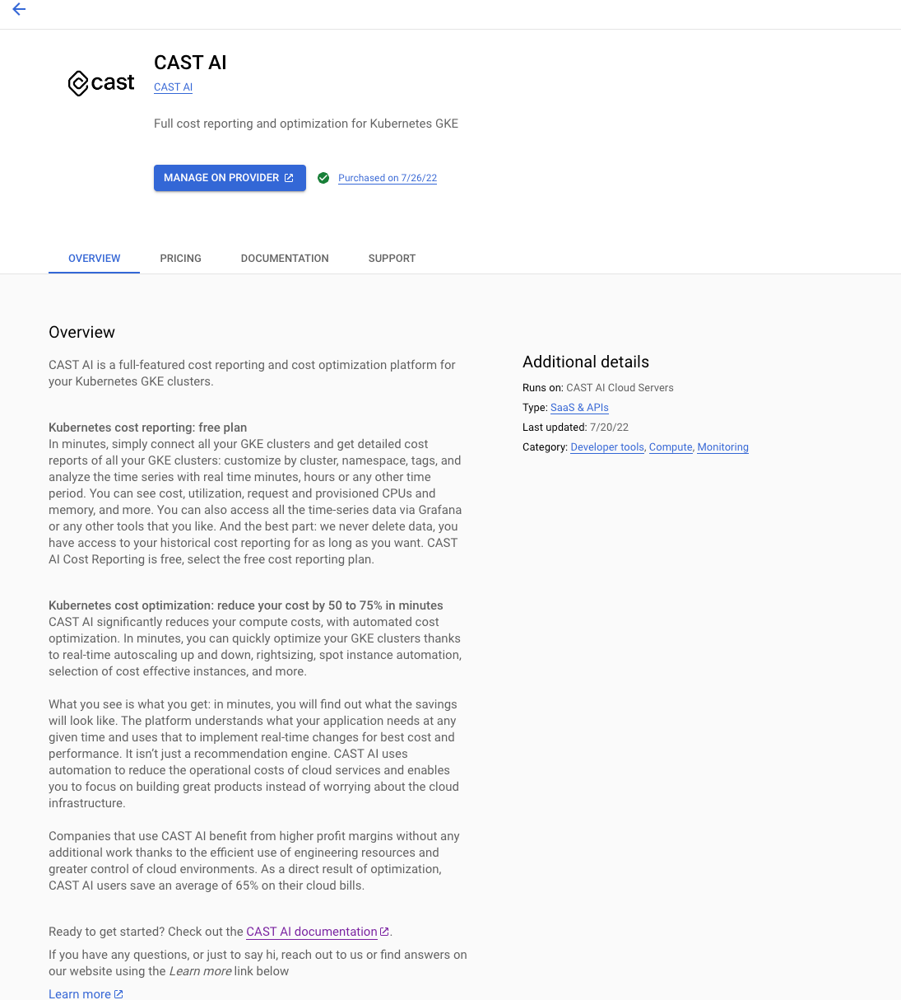

# GCP Marketplace onboarding

## Google Cloud Marketplace Solutions

GCP Marketplace is a Google cloud solution where you can buy dedicated offering. Buying solution via GCP Marketplace allows you to have all cloud spending in one place

## Requirements

To onboard CAST AI organization using Google Cloud Marketplace you need to have:

* access to GCP Marketplace in your GCP project (access to billing account )
* access to CAST AI console

## Finding CAST AI offering in Google Marketplace

Navigate to Google Marketplace website and search for `CAST AI` or use this [link](https://console.cloud.google.com/marketplace/product/castai-public/cast-ai?)

CAST AI offering

## Subscribing to CAST AI in GCP Marketplace

Click **SELECT**  to chose your plan

Agree to term of service and Subscribe (before doing this please make sure your browser accepts popups from Google Marketplace page)

## Registration in CAST AI console

The next step is registration inside CAST AI console page. You need click **Register with CAST AI**

After which you should be redirected to CAST AI console where **you need to log in** to organization for which Google Marketplace subscription should be assigned.

Normal CAST AI log in screen

Cluster view after successful log in

## Validation

After all of above steps will be completed your CAST AI subscription should be in active state.

