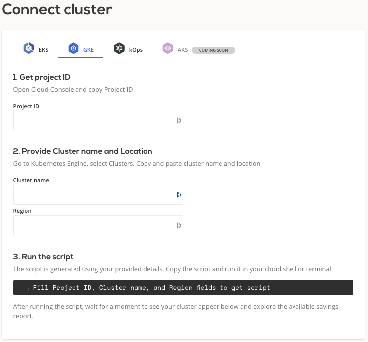
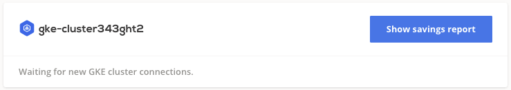

# GCP GKE

## Connect cluster

To connect your cluster, [log in to the CAST AI console](https://console.cast.ai/external-clusters/new) and navigate to **Connect cluster** window, [**GKE**](https://console.cast.ai/external-clusters/new#gke) tab. Copy the pre-generated script and run it inside your terminal or cloud shell. Make sure that kubectl is installed and can access your cluster.



The script will create following kubernetes objects related to `castai-agent` agent:

- namespace and deployment
- serviceaccount and secret
- clusterrole and clusterrolebinding
- role and rolebinding
- resourcequota
- configmap

After the installation, your cluster name will appear below connection instructions as well as in the **Clusters** list.



From there, you can open the **Available savings** report and explore a detailed savings estimate based on your cluster configuration.

!!! note ""
    The agent will run in read-only mode providing saving suggestions without any actual modifications.

## Credential onboarding

To unlock all the benefits and enable automatic cost optimization, CAST AI must have access to your cluster. The following
section describes the steps required to onboard the GKE cluster on the CAST AI console. To make it less troublesome, we created
a script that automates most of the steps.

Prerequisites:

- `gcloud` - A command line tool for working with GKE services using commands in your command-line shell. For more
  information, see [Installing gcloud](https://cloud.google.com/sdk/docs/install).

- `IAM permissions` – The IAM user that you're using must have:
    - Access to the project where the cluster is created.
    - Permissions to work with IAM, GKE, and compute resources.
    - The CAST AI agent has to be running on the cluster.

Onboarding steps:

To onboard your cluster, go to the **Available Savings** report and click on the **Start saving** or **Enable CAST AI** button. The button's name will depend on the level of optimization available for your cluster.

Copy the pre-generated script and run it inside your terminal or cloud shell. The script will create new GKE service account with the required roles. The generated user will have the following permissions:

- `/roles/cast.gkeAccess` (created by script) - access to get / update your GKE cluster and manage compute instances.
- `roles/container.developer` - access to resources within the Kubernetes cluster.

That’s it! Your cluster is onboarded. Now you can enable CAST AI [Autoscaler](../../product-overview/console/autoscaler.md) to keep your cluster configuration optimal.

[Connect your cluster here](https://console.cast.ai/external-clusters/new#gke)

## Actions performed by the onboarding script
The script will perform the following actions:

-  Enables following GCP services and APIs for the project on which GKE cluster is running:

| GCP Service / API Group                                                                                            | Description                                                          |
|--------------------------------------------------------------------------------------------------------------------|:---------------------------------------------------------------------|
| [`serviceusage.googleapis.com`](https://cloud.google.com/service-usage/docs/reference/rest){target="_blank"}       | API to list, enable and disable GCP services                         |
| [`iam.googleapis.com`](https://cloud.google.com/iam/docs/reference/rest){target="_blank"}                          | API to manage identity and access control for GCP resources          |
| [`cloudresourcemanager.googleapis.com`](https://cloud.google.com/resource-manager/reference/rest){target="_blank"} | API to create, read, and update metadata for GCP resource containers |
| [`container.googleapis.com`](https://cloud.google.com/kubernetes-engine/docs/reference/rest){target="_blank"}      | API to manage GKE                                                    |
| [`compute.googleapis.com`](https://cloud.google.com/compute/docs/reference/rest/v1){target="_blank"}               | API to manage GCP virtual machines                                   |

- Creates a dedicated GCP service account `castai-gke-<cluster-name-hash>` used by CAST AI to request and manage GCP resources on customer's behalf.

- Creates a custom role `castai.gkeAccess` with following permissions:

```shell
- compute.addresses.use
- compute.disks.create
- compute.disks.setLabels
- compute.disks.use
- compute.images.useReadOnly
- compute.instanceGroupManagers.get
- compute.instanceGroupManagers.update
- compute.instanceGroups.get
- compute.instanceTemplates.create
- compute.instanceTemplates.delete
- compute.instanceTemplates.get
- compute.instanceTemplates.list
- compute.instances.create
- compute.instances.delete
- compute.instances.get
- compute.instances.list
- compute.instances.setLabels
- compute.instances.setMetadata
- compute.instances.setServiceAccount
- compute.instances.setTags
- compute.instances.start
- compute.instances.stop
- compute.networks.use
- compute.networks.useExternalIp
- compute.subnetworks.get
- compute.subnetworks.use
- compute.subnetworks.useExternalIp
- compute.zones.get
- compute.zones.list
- container.certificateSigningRequests.approve
- container.clusters.get
- container.clusters.update
- container.operations.get
- serviceusage.services.list
```

- Attaches following roles to `castai-gke-<cluster-name-hash>` service account:
  
  | Role name                | Description                                                                                               |
  |-----------------------------------------------------------------------------------------------------------|:--------------------------------------------------------------------------------------------------------------------|
  | `castai.gkeAccess`       | CAST AI managed role used to manage CAST AI add/delete node operations, full list of permissions listed above |
  | `container.developer`    | GCP managed role for full access to Kubernetes API objects inside Kubernetes cluster                      |
  | `iam.serviceAccountUser` | GCP managed role to allow run operations as the service account                                           |

- Installs Kubernetes components required for a successful experience with CAST AI:

```shell
$ kubectl get deployments.apps   -n castai-agent
NAME                        READY   UP-TO-DATE   AVAILABLE   AGE
castai-agent                1/1     1            1           15m
castai-agent-cpvpa          1/1     1            1           15m
castai-cluster-controller   2/2     2            2           15m
castai-evictor              0/0     0            0           15m
castai-kvisor               1/1     1            1           15m

$ kubectl get daemonsets.apps -n castai-agent
NAME                   DESIRED   CURRENT   READY   UP-TO-DATE   AVAILABLE   NODE SELECTOR                            AGE
castai-spot-handler    0         0         0       0            0           scheduling.cast.ai/spot=true             15m
```

Full overview of hosted components can be found [here](../../product-overview/hosted-components.md).

## GKE node pools created by CAST AI

After cluster is onboarded CAST AI will create two GKE node pools:

- castpool - is used to gather necessary data required for CAST AI managed GKE x86 nodes creation
- castpool-arm - is used to gather necessary data required for CAST AI managed GKE ARM64 nodes creation. `castpool-arm` is created only if the cluster region support ARM64 VMs

## Disconnect GKE cluster

In order to disconnect your cluster from CAST AI click **Disconnect cluster** button in **Clusters** list and follow the guidance. Alternatively, run the following command from your terminal used to access the cluster:

```bash
kubectl delete deployment castai-agent -n castai-agent
```

Once the cluster is disconnected, its `Status` will change to `Disconnected` and you can choose to remove it from the console by pressing the **Delete cluster** button.

!!! note ""
    The cluster will continue to run as normal, since the **Delete cluster** action only removes it from CAST AI console.
