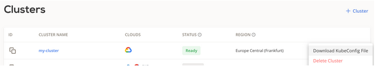

A CAST AI managed Kubernetes cluster is no different than vanilla Kubernetes - it just runs on multi-cloud. Having this in mind, you can deploy an application just like you would in any Kubernetes cluster - by using **kubectl**.

After creating your cluster in the CAST AI console and making sure that it’s in the ready state, you can download the cluster’s **kubeconfig**:



For detailed instructions on how to use a downloaded kubeconfig file, check the [official Kubernetes documentation](https://kubernetes.io/docs/concepts/configuration/organize-cluster-access-kubeconfig/).

The quickest way is simply by setting a downloaded file as KUBECONFIG env variable in your shell. For example:

```
export KUBECONFIG=~/Downloads/my-cluster_config
```
Once you do this, you will have access to my-cluster in your used shell. From now on, you can deploy any application using kubectl. Here’s a [tutorial from Kubernetes official documentation](https://kubernetes.io/docs/tutorials/kubernetes-basics/deploy-app/deploy-intro/).

If you’re tired of reading documentation and just want to get started, run the following:

```
kubectl apply -f https://k8s.io/examples/application/deployment.yaml
```

The command will use the following deployment YAML file from k8s, for example:
```
apiVersion: apps/v1 
kind: Deployment 
metadata: 
  name: nginx-deployment 
spec: 
  selector: 
    matchLabels: 
      app: nginx 
  replicas: 2 # tells deployment to run 2 pods matching the template 
  template: 
    metadata: 
      labels: 
        app: nginx 
    spec: 
      containers: 
      - name: nginx 
        image: nginx:1.14.2 
        ports: 
        - containerPort: 80
```
For displaying information about the Deployment run:

```
kubectl describe deployment nginx-deployment
```

The output is similar to this:


List the pods created by the deployment:

```
kubectl get pods -l app=nginx
```

The output is similar to this:


Display information about a Pod:
```
kubectl describe pod <pod-name>
```

where <pod-name> is the name of one of your Pods.

