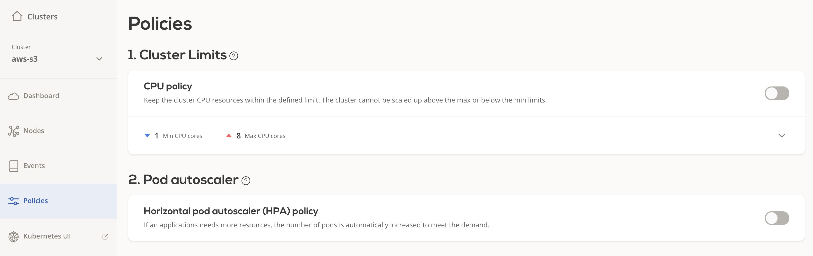
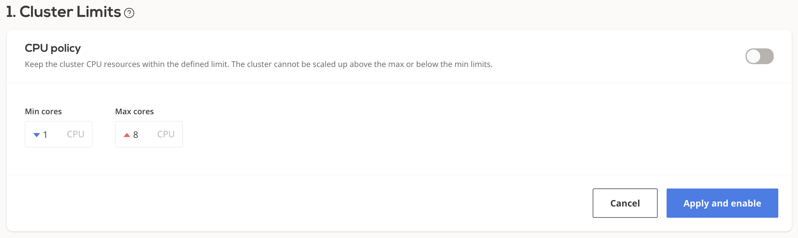
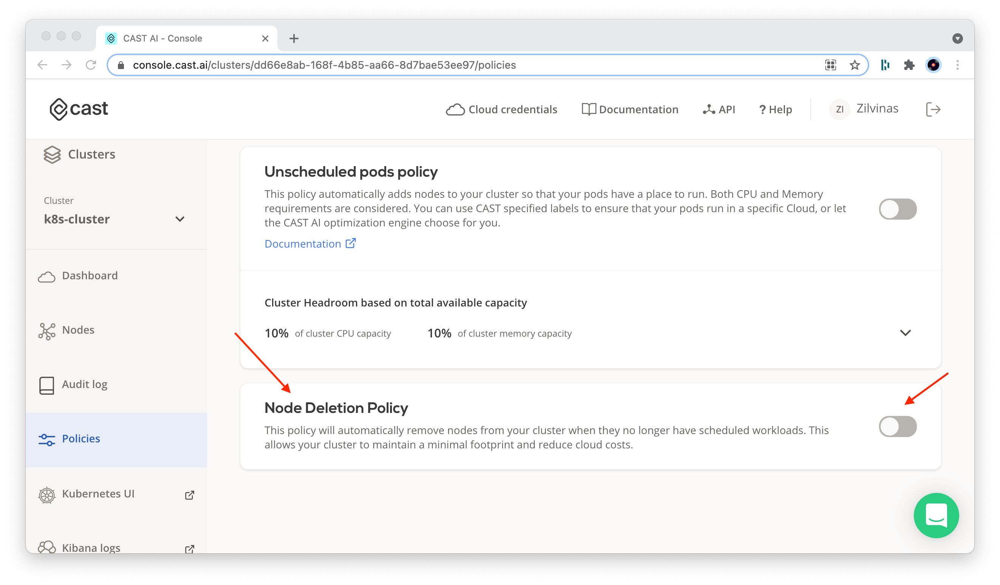
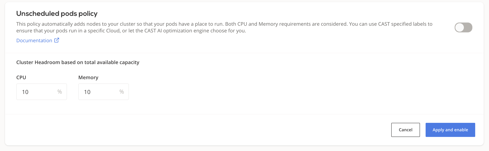

# Autoscaling policies

Autoscaling policies define a set of rules based on which your cluster is monitored and scaled to maintain steady
performance at the lowest possible cost.

This topic describes the available policy configuration options and provides guidance on how to configure them.

## Prerequisites

- **CAST AI cluster** - see [create cluster](../getting-started.md).

Select a cluster and navigate to the *Policies* menu.



## Cluster CPU limits policy

Each CAST AI cluster size can be limited by **the total amount** of vCPUs available on all the worker nodes
used to run workloads.
If disabled, the cluster can upscale indefinitely and downscale to 0 worker nodes, depending on the actual
resource consumption.

### Configuring CPU limits policy

You can adjust a cluster's CPU limits settings either via the [CAST AI console:](https://console.cast.ai/)



or via the [CAST AI policies API endpoint](https://api.cast.ai/v1/spec/#/cluster-policies/UpsertPolicies) by setting
values for

```JSON
"clusterLimits": {
    "cpu": {
      "maxCores": <value>,
      "minCores": <value>
    },
    "enabled": <value>
}
```

The new settings will propagate immediately.

## Horizontal Pod Autoscaler (HPA) policy

See [HPA documentation](../guides/hpa.md) for a detailed overview.

## Node deletion policy



This policy will automatically remove nodes from your cluster when they no longer have scheduled workloads.
This allows your cluster to maintain a minimal footprint and reduce cloud costs.

## Unscheduled pods policy

A pod becomes unschedulable when the Kubernetes scheduler cannot find a node to assign the pod to.
For instance, a pod can request more CPU or memory than the resources available on any of the worker nodes.

In many such cases, this indicates the need to scale up by adding additional nodes to the cluster.

The CAST AI autoscaler is equipped with a mechanism to handle this.

### Headroom attributes

Headroom is a buffer of spare capacity (in terms of both memory and CPU) to ensure that cluster can meet suddenly increased demand for resources. It is based on the currently
available total worker nodes resource capacity. For example, if headroom for memory and CPU are both set to 10%,
and the cluster consists of 2 worker nodes equipped with 2 cores and 4GB RAM each, _a total of 0.4 cores and 819MB_
would be considered as headroom in the next cluster size increase phase.

### Provisioning decision

- After receiving the unschedulable pods event, the CAST AI recommendation engine will select the best
price/performance ratio node capable of accommodating all of the currently unschedulable pods plus headroom.
- CAST AI will then provision it and join with the cluster. This process usually takes a few minutes, depending on the cloud service provider of your choice.
- Currently, only a single node will be added at a time. If any unschedulable pods still remain, the cycle is
repeated until all the pods are scheduled (provided that the reason was insufficient resources).

### Configuring the unscheduled pod's policy

You can enable/disable the unschedulable pod's policy and set headroom settings either on the [CAST AI console](https://console.cast.ai/):



or via the [CAST AI policies API endpoint](https://api.cast.ai/v1/spec/#/cluster-policies/UpsertPolicies) by setting
values for

```JSON
"unschedulablePods": {
    "enabled": <value>,
    "headroom": {
        "cpuPercentage": <value>,
        "memoryPercentage": <value>
    }
}
```

It may take a few minutes for the new settings to propagate.

## Policies precedence rules

If multiple policies are enabled and multiple rules are triggered during the same evaluation period, they will be
handled in the following order:

1. [Cluster CPU limits policy](#cluster-cpu-limits-policy)
2. [Horizontal Pod Autoscaler (HPA) policy](#horizontal-pod-autoscaler-hpa-policy)
3. [Unscheduled pods policy](#unscheduled-pods-policy)
4. [Node deletion policy](#node-deletion-policy)
5. [Cluster CPU utilization scale-up policy](#cluster-cpu-utilization-scale-up-policy)
