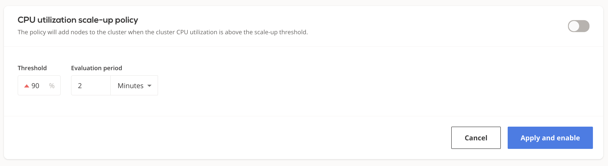
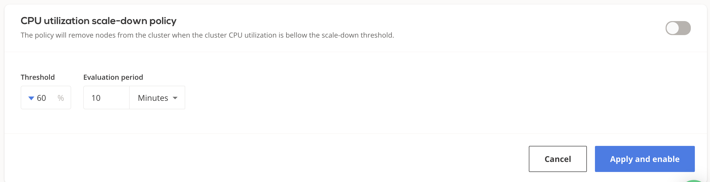

# Autoscaling policies

Autoscaling policies define a set of rules based on which your cluster is monitored and scaled to maintain steady
performance at the lowest possible cost.

This topic describes the available policy configuration options and provides guidance on how to configure them.

## Prerequisites

To enable the autoscaling policies, you need to create a cluster first. Here's a guide that shows you how to create a cluster: [Creating your first
cluster](https://castai.github.io/docs/getting-started/creating-your-first-cluster/).

To see the available policy settings, select your cluster and navigate to _Policies_ on
[CAST AI's console](https://console.cast.ai/):


## Cluster CPU limits policy

Each CAST AI cluster size can be limited by **the total amount** of vCPUs available on all the worker nodes
used to run workloads.
If disabled, the cluster can upscale indefinitely and downscale to 0 worker nodes, depending on the actual
resource consumption.

### Configuring CPU limits policy

You can adjust a cluster's CPU limits settings either via the [CAST AI console:](https://console.cast.ai/)


or via the [CAST AI policies API endpoint](https://api.cast.ai/v1/spec/#/cluster-policies/UpsertPolicies) by setting
values for

```json
"clusterLimits": {
    "cpu": {
      "maxCores": <value>,
      "minCores": <value>
    },
    "enabled": <value>
}
```

The new settings will propagate immediately.

## Horizontal Pod Autoscaler (HPA) policy

See HPA documentation for a detailed overview.

## Unscheduled pods policy

A pod becomes unschedulable when the Kubernetes scheduler can't find a node that can accommodate the pod.
For instance, a pod can request more CPU or memory than the resources available on any of the worker nodes.
In many such cases, this indicates the need to scale up by adding additional nodes to the cluster.
The CAST AI autoscaler is equipped with a mechanism to handle this.

After receiving the unschedulable pods event, the CAST AI recommendation engine will select the best price/performance ratio node able to accommodate all of the currently unschedulable pods.
CAST AI will then provision it and join with the cluster. This process usually takes a few minutes, depending on the cloud service provider of your choice.
Currently, only a single node will be added at a time. If any unschedulable pods still remain, the cycle is
repeated until all the pods are scheduled (provided that the reason was insufficient resources).

### Configuring the unscheduled pods policy

You can enable/disable the unschedulable pods policy either on the [CAST AI console:](https://console.cast.ai/):


or via the [CAST AI policies API endpoint](https://api.cast.ai/v1/spec/#/cluster-policies/UpsertPolicies) by setting
values for

```json
"unschedulablePods": {
    "enabled": <value>,
    "evaluationPeriodSeconds": <value>
}
```

It may take a few minutes for the new settings to propagate.

## Cluster CPU utilization scale up policy

An increased CPU load on worker nodes indicates that the cluster is getting 'hot' - the fleet of nodes might not
be sufficient to fulfill the current computing resources needs.
In that case, you can increase the computing capacity by adding in additional worker nodes.
CAST AI's cluster autoscaler provides a mechanism to handle this with _CPU utilization scale up policy_.
By applying this policy, your cluster is periodically checked for the actual CPU consumption over the worker nodes.
When a sustained increased CPU load is detected, the autoscaler automatically adds a new node to redistribute the load
more evenly.
This process can take a few minutes, depending on the underlying cloud service provider. If an addition is already in progress, the autoscaler will
not attempt to add a new node.

### Configuring the CPU utilization scale up policy

The autoscaler's scale up policy is set by adjusting thresholds for the average cluster CPU load in percentages and evaluation
period in seconds.
The evaluation window describes for how long the average cluster CPU utilization should stay above the threshold for it to
be considered as eligible for scale up.

You can edit settings for this policy via the [CAST AI console](https://console.cast.ai/):



or the [CAST AI policies API endpoint](https://api.cast.ai/v1/spec/#/cluster-policies/UpsertPolicies) by setting values
for

```json
"cpuUtilization": {
    "scaleUpThreshold": {
      "avgCpuLoadPercentageMoreThan": <value>,
      "enabled": <value>,
      "evaluationPeriodSeconds": <value>
    }
}
```

It may take a few minutes for the new settings to propagate.

## Cluster CPU utilization scale down policy

The CAST AI node autoscaler decreases the size of the cluster when some worker nodes are unneeded for a
significant amount of time and consistently.
A node is considered as unneeded when it has a low actual CPU utilization. In the event of a scale down, a node will be drained
and removed from a cluster if:

* other worker nodes meet the resource (CPU, memory) demand of the currently running pods,
* it doesn't contain any pods with volumes attached - the node is stateless,
* it doesn't contain any pods with the restrictive
[PodDisruptionBudget](https://kubernetes.io/docs/concepts/workloads/pods/disruptions/#pod-disruption-budgets),
* it doesn't contain any pods that cannot be moved elsewhere due to the node selection constraints (non-matching node selectors
 or affinity, matching anti-affinity, etc.).

If the autoscaler fails to find worker nodes eligible for deletion, the cluster's state will not be affected.
Otherwise, it will attempt to remove only a single node at a time. In that case, the autoscaler issues termination of the underlying instance in a cloud-provider-dependent manner.
This process usually takes a few minutes.
  
### Configuring CPU utilization scale down policy

You can control the autoscaler's scale down policy by adjusting thresholds for the average cluster CPU load in percentages and
 evaluation period in seconds.
The evaluation window describes how long the average cluster CPU utilization should stay below a threshold for it to be
 considered as eligible for scale down.

Scale down policy settings can be adjusted via the [CAST AI console:](https://console.cast.ai/):



or the [CAST AI policies API endpoint](https://api.cast.ai/v1/spec/#/cluster-policies/UpsertPolicies) by setting values
 for

```json
"cpuUtilization": {
    "scaleDownThreshold": {
      "avgCpuLoadPercentageLessThan": <value>,
      "enabled": <value>,
      "evaluationPeriodSeconds": <value>
    }
}
```  

It may take a few minutes for the new settings to propagate.

## Policies precedence rules

If multiple policies are enabled and multiple rules are triggered during the same evaluation period, they will be
handled in the following order:

* [Cluster CPU limits policy](#cluster-cpu-limits-policy)
* [Horizontal Pod Autoscaler (HPA) policy](#horizontal-pod-autoscaler-hpa-policy)
* [Unscheduled pods policy](#unscheduled-pods-policy)
* [Cluster CPU utilization scale up policy](#cluster-cpu-utilization-scale-up-policy)
* [Cluster CPU utilization scale-down policy](#cluster-cpu-utilization-scale-down-policy)
