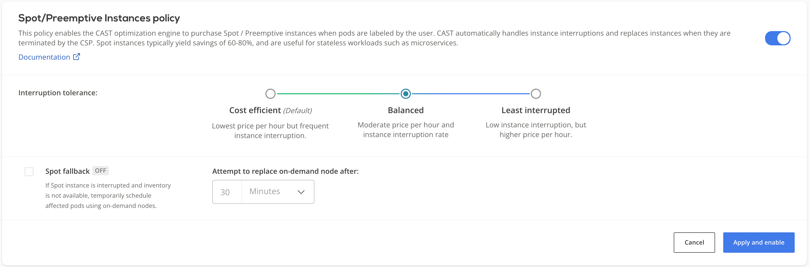

# Autoscaling policies

Autoscaling policies define the set of rules based on which your cluster is monitored and scaled to maintain steady
performance at the lowest possible cost.

This topic describes the available policy configuration options and provides guidance on how to configure them.

## Prerequisites

Onboard a cluster - see [connect cluster](../getting-started/overview.md)

Once you've connected a cluster, select it and navigate to the **Autoscaler** menu.


## Scoped autoscaler mode

Autoscaler features described below can be made to act only on a subset of your cluster. By marking specific workloads for autoscaling, only that subset will be considered by the unscheduled pods policy, and the empty nodes policy will only clean up nodes that the autoscaler has previously created.

While this mode is turned on, the autoscaler-created nodes will have a specific taint: `scheduling.cast.ai/scoped-autoscaler=true:NoSchedule`. This ensures that only the subset of workloads specifically meant for the scoped autoscaler will be scheduled on these nodes.

For pods that you wish to be included, update your relevant deployments to contain this configuration:

```yaml
apiVersion: apps/v1
kind: Deployment
spec:
  template:
    spec:
      nodeSelector:
        provisioner.cast.ai/managed-by: cast.ai
      tolerations:
      - key: "scheduling.cast.ai/scoped-autoscaler"
        operator: "Exists"
        effect: "NoSchedule"
```

The node selector will ensure that pods only schedule on CAST AI-provisioned nodes. Also, this specific selector is what the scoped autoscaler is looking for when deciding which unsheduled pods are within the scope.

Toleration is required for the above-described reasons: we want the pods to actually be able to be scheduled on provisioned nodes. If toleration is not present, this will be treated as misconfiguration and the pod will be ignored.

## Cluster CPU limits policy

Each CAST AI cluster size can be limited by **the total amount** of vCPUs available on all the worker nodes
used to run workloads.
If disabled, the cluster can upscale indefinitely and downscale to 0 worker nodes, depending on the actual
resource consumption.

### Configuring CPU limits policy

You can adjust a cluster's CPU limits settings either via the [CAST AI console:](https://console.cast.ai/)


or via the [CAST AI policies API endpoint](https://api.cast.ai/v1/spec/#/cluster-policies/UpsertPolicies) by setting
values for

```JSON
"clusterLimits": {
    "cpu": {
      "maxCores": <value>,
      "minCores": <value>
    },
    "enabled": <value>
}
```

The new settings will propagate immediately.

## Horizontal Pod Autoscaler (HPA) policy

For now, the HPA policy is only supported on clusters created in CAST AI. See [HPA documentation](../guides/hpa.md) for a detailed overview.

## Spot/Preemptive Instances policy



This policy instructs the CAST AI optimization engine to purchase Spot / Preemptive instances and place specifically labelled pods on those instances. CAST AI automatically handles instance interruptions and replaces instances when they are terminated by the CSP. You can find a detailed guide on how to configure your workloads to run on Spot instances [here](../guides/spot.md).

The following configuration settings can be applied to the policy.

### Interruption tolerance

Using the *interruption tolerance* setting, you can restrict which instances types the autoscaler should consider when choosing the Spot instance type. The default "Cost efficient" option means that the autoscaler will choose the cheapest option, regardless of the selected instance type's reliability; choosing "Least interrupted" will ensure that selection will be done only from most reliable instances.

### Spot fallback

By using this feature, you can guarantee that workloads designated for spot instances have capacity to run even if spot inventory is temporarily not available. To mitigate the impact of spot drought, CAST AI provisions *fallback* node (i.e. a temporary on-demand node) and use it to schedule the impacted workloads. Once the configured time expires, CAST AI will automatically attempt to find the suitable spot node. If it is available, it will get provisioned - then the *fallback* node will be drained and deleted. As a result, the impacted workloads will get scheduled on the spot node in the same way as prior to the spot drought event.

## Storage Optimized Instances policy

This policy instructs the CAST AI engine to purchase Storage Optimized instances and place specifically labelled pods on those instances. CAST AI automatically handles instance interruptions and replaces instances when they are terminated by the CSP. You can find a detailed guide on how to configure your workloads to run on Storage Optimized instances [here](../guides/storage-optimized.md).

## Unscheduled pods policy

A pod becomes unschedulable when the Kubernetes scheduler cannot find a node to which it can assign the pod.
For instance, a pod can request more CPU or memory than the resources available on any of the worker nodes.

In many such cases, this indicates the need to scale up by adding additional nodes to the cluster.

The CAST AI autoscaler is equipped with a mechanism to handle this.

### Headroom attributes

Headroom is a buffer of spare capacity (in terms of both memory and CPU) to ensure that cluster can meet suddenly increased demand for resources. It is based on the currently available total worker nodes resource capacity.

For example, if headroom for memory and CPU are both set to 10%,
and the cluster consists of 2 worker nodes equipped with 2 cores and 4GB RAM each, _a total of 0.4 cores and 819MB_
would be considered as headroom in the next cluster size increase phase.

### Node constraints

Node constraints limit the possible node pool for CAST AI to choose from when adding a node to a cluster. Entered **Min CPU** and **Max CPU** as well as **Min memory** and **Max memory** values are respected when selecting the next node to be added to the cluster, this way user influences the composition of the cluster in terms of size and number of nodes.

Since this decision is driven by the customer and not by CAST AI optimization engine, it might not result in the most cost effective node added. However, this feature is particularly  beneficial when migrating into CAST AI selected nodes and securing additional capacity upfront (i.e. adding larger nodes, but knowing that during migration they would be filled up).

The system supports the following CPU to Memory ratios: 1:2, 1:4 and 1:8. Based on the example presented in the picture, CAST AI would consider 4CPU16GiB RAM and 4CPU 32GiB RAM instances


### Provisioning decision

- After receiving the unschedulable pods event, the CAST AI recommendation engine will select the best
price/performance ratio node capable of accommodating all of the currently unschedulable pods plus headroom or respecting node constraints.
- CAST AI will then provision it and join with the cluster. This process usually takes a few minutes, depending on the cloud service provider of your choice.
- Currently, only a single node will be added at a time. If any unschedulable pods still remain, the cycle is
repeated until all the pods are scheduled (provided that the reason was insufficient resources).

### Configuring the unscheduled pod's policy

You can enable/disable the unschedulable pod's policy and set headroom settings as well as node constraints either on the [CAST AI console](https://console.cast.ai/) or via the [CAST AI policies API endpoint](https://api.cast.ai/v1/spec/#/cluster-policies/UpsertPolicies) by setting values for headroom:

```JSON
"unschedulablePods": {
    "enabled": <value>,
    "headroom": {
        "cpuPercentage": <value>,
        "enabled": <value>,
        "memoryPercentage": <value>
    }
}
```

or for node constraints:

```JSON
"unschedulablePods": {
    "enabled": <value>,
    "headroom": {
        "enabled": <value>,
        "maxCpuCores": <value>,
        "maxRamMib": <value>,
        "minCpuCores": <value>,
        "minRamMib": <value>
    }
}
```

It may take a few minutes for the new settings to propagate.

## Node deletion policy

This policy will automatically remove nodes from your cluster when they no longer have scheduled workloads.
This allows your cluster to maintain a minimal footprint and reduce cloud costs.


If **Keep empty node alive for** is set to 0, CAST AI moves to delete an empty node as soon as it is detected. In cases when a user wants to keep the empty node in the cluster for a period of time, a time parameter can be set, effectively delaying the deletion.

### Disable deletion of specific node(s)

If you annotate or label a node with `autoscaling.cast.ai/removal-disabled="true"`, the *Node deletion policy* won't delete it even if it is completely empty.

#### Labeling the node(s)

You can label nodes using `kubectl` in the following fashion:

- Specific node(s):

```sh
# replace <node_name> with your node name of choice
kubectl label node <node_name> [<node_name> ...] autoscaling.cast.ai/removal-disabled=true
# e.g. to label node `myclusternode-e359fefa-d3a2` run this command:
kubectl label node myclusternode-e359fefa-d3a2 autoscaling.cast.ai/removal-disabled=true
# e.g. to label two nodes `myclusternode-e359fefa-d3a2` and myclusternode-anothernode run this command:
kubectl label node myclusternode-e359fefa-d3a2 myclusternode-anothernode autoscaling.cast.ai/removal-disabled=true
```

- Many nodes using label selector

```sh
# replace <label> with your node name of choice
kubectl label node -l <label> autoscaling.cast.ai/removal-disabled=true
# e.g. to label nodes in availability zone `europe-west3-c` run this command:
kubectl label node -l topology.kubernetes.io/zone=europe-west3-c autoscaling.cast.ai/removal-disabled=true
```

- All nodes

```sh
kubectl label node --all autoscaling.cast.ai/removal-disabled=true
```

#### Removing the label

In order to instruct policy to delete the node, you need to remove the label. Using previously described methods, instruct `kubectl` to label a node with `autoscaling.cast.ai/removal-disabled-` (note the `-` symbol instead of `=true`).

#### Evictor

CAST AI Evictor also respects this label or annotation so it won't try to evict marked nodes.

## Policies precedence rules

If multiple policies are enabled and multiple rules are triggered during the same evaluation period, they will be
handled in the following order:

1. [Cluster CPU limits policy](#cluster-cpu-limits-policy)
2. [Horizontal Pod Autoscaler (HPA) policy](#horizontal-pod-autoscaler-hpa-policy)
3. [Unscheduled pods policy](#unscheduled-pods-policy)
4. [Node deletion policy](#node-deletion-policy)
