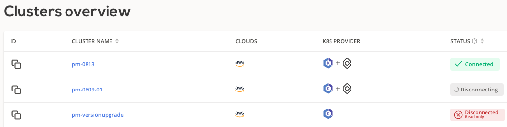
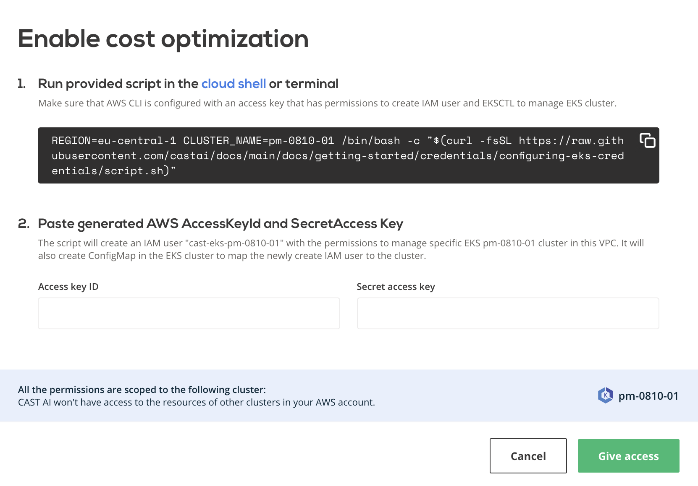
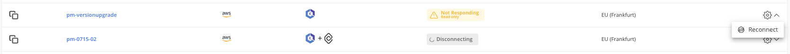
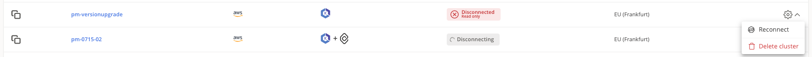

# External cluster troubleshooting

This guide is intended for users who are experiencing issues while connecting their EKS, GCP, or AKS clusters to CAST AI. Once the cluster is connected, you can check the `Status` field in the **Clusters overview** screen to understand if cluster is operating as expected.



Further sections will cover the most common issues and how to resolve them.

## Your cluster does not appear in the Connect Cluster screen

If a cluster does not appear in the Connect your cluster screen after you've run the connection script, perform following steps.

1. Check agent container logs:

    ```shell
    kubectl logs -n castai-agent -l app.kubernetes.io/name=castai-agent -c agent
    ```

2. You might get output similar to this:

    ```text
    time="2021-05-06T14:24:03Z" level=fatal msg="agent failed: registering cluster: getting cluster name: describing instance_id=i-026b5fadab5b69d67: UnauthorizedOperation: You are not authorized to perform this operation.\n\tstatus code: 403, request id: 2165c357-b4a6-4f30-9266-a51f4aaa7ce7"
    ```

    or

    ```text
    time="2021-05-06T14:24:03Z" level=fatal msg=agent failed: getting provider: configuring aws client: NoCredentialProviders: no valid providers in chain"
    ```

These errors indicate that the CAST AI Agent failed to connect to the AWS API either because the nodes and/or workloads running in your cluster have custom constrained IAM permissions or the IAM roles are removed entirely. However, the CAST AI Agent requires read-only access to the AWS EC2 API to correctly identify some properties of your EKS cluster. Access to the AWS EC2 Metadata endpoint is optional, but the variables discovered from the endpoint must then be provided. The CAST AI Agent uses the official AWS SDK, so all variables to customize your authentication mentioned in its [documentation](https://docs.aws.amazon.com/cli/latest/userguide/cli-configure-envvars.html) are supported.

Provide cluster metadata by adding these environment variables to the CAST AI Agent deployment:

```text
EKS_ACCOUNT_ID = your-aws-account-id
EKS_REGION = your-eks-cluster-region
EKS_CLUSTER_NAME = your-eks-cluster-name
```

The CAST AI agent requires read-only permissions, so the default `AmazonEC2ReadOnlyAccess` is enough. Provide AWS API access by adding these environment variables to the CAST AI Agent secret:

```text
AWS_ACCESS_KEY_ID = xxxxxxxxxxxxxxxxxxxx
AWS_SECRET_ACCESS_KEY = xxxxxxxxxxxxxxxxxxxxxxxxxxxxxxxxxxxxxxxx
```

Here is an example of a CAST AI Agent deployment and secret with all the mentioned environment variables added:

```yaml
# Source: castai-agent/templates/deployment.yaml
apiVersion: apps/v1
kind: Deployment
metadata:
  name: castai-agent
  namespace: castai-agent
  labels:
    app.kubernetes.io/name: castai-agent
    app.kubernetes.io/instance: castai-agent
    app.kubernetes.io/version: "v0.23.0"
    app.kubernetes.io/managed-by: castai
spec:
  replicas: 1
  selector:
    matchLabels:
      app.kubernetes.io/name: castai-agent
      app.kubernetes.io/instance: castai-agent
  template:
    metadata:
      labels:
        app.kubernetes.io/name: castai-agent
        app.kubernetes.io/instance: castai-agent
    spec:
      priorityClassName: system-cluster-critical
      serviceAccountName: castai-agent
      affinity:
        nodeAffinity:
          requiredDuringSchedulingIgnoredDuringExecution:
            nodeSelectorTerms:
              - matchExpressions:
                  - key: "kubernetes.io/os"
                    operator: In
                    values: [ "linux" ]
              - matchExpressions:
                  - key: "beta.kubernetes.io/os"
                    operator: In
                    values: [ "linux" ]

      containers:
        - name: agent
          image: "us-docker.pkg.dev/castai-hub/library/agent:v0.24.0"
          imagePullPolicy: IfNotPresent
          env:
            - name: API_URL
              value: "api.cast.ai"
            - name: PPROF_PORT
              value: "6060"
            - name: PROVIDER
              value: "eks"

            # Provide values discovered via AWS EC2 Metadata endpoint:
            - name: EKS_ACCOUNT_ID
              value: "000000000000"
            - name: EKS_REGION
              value: "eu-central-1"
            - name: EKS_CLUSTER_NAME
              value: "castai-example"

          envFrom:
            - secretRef:
                name: castai-agent
          resources:
            requests:
              cpu: 100m
            limits:
              cpu: 1000m
        - name: autoscaler
          image: k8s.gcr.io/cpvpa-amd64:v0.8.3
          command:
            - /cpvpa
            - --target=deployment/castai-agent
            - --namespace=castai-agent
            - --poll-period-seconds=300
            - --config-file=/etc/config/castai-agent-autoscaler
          volumeMounts:
            - mountPath: /etc/config
              name: autoscaler-config
      volumes:
        - name: autoscaler-config
          configMap:
            name: castai-agent-autoscaler
```

```yaml
# Source: castai-agent/templates/secret.yaml
apiVersion: v1
kind: Secret
metadata:
  name: castai-agent
  namespace: castai-agent
  labels:
    app.kubernetes.io/instance: castai-agent
    app.kubernetes.io/managed-by: castai
    app.kubernetes.io/name: castai-agent
    app.kubernetes.io/version: "v0.23.0"
data:
  # Keep API_KEY unchanged.
  API_KEY: "xxxxxxxxxxxxxxxxxxxx"
  # Provide an AWS Access Key to enable read-only AWS EC2 API access:
  AWS_ACCESS_KEY_ID: "xxxxxxxxxxxxxxxxxxxx"
  AWS_SECRET_ACCESS_KEY: "xxxxxxxxxxxxxxxxxxxxxxxxxxxxxxxxxxxxxxxx"
```

Alternatively, if you are using [IAM roles for service accounts](https://docs.aws.amazon.com/eks/latest/userguide/iam-roles-for-service-accounts.html) instead of providing AWS credentials you can annotate castai-agent service account with your IAM role.

```shell
kubectl annotate serviceaccount -n castai-agent castai-agent eks.amazonaws.com/role-arn="arn:aws:iam::111122223333:role/iam-role-name"
```

## Spot nodes are displayed as On-demand in your cluster's Available Savings page

See this [section](#your-cluster-does-not-appear-in-the-connect-cluster-screen).

## TLS handshake timeout issue

In some edge cases due to specific cluster network setup agent might fail with the following message in the agent container logs:

  ```text
  time="2021-11-13T05:19:54Z" level=fatal msg="agent failed: registering cluster: getting namespace \"kube-system\": Get \"https://100.10.1.0:443/api/v1/namespaces/kube-system\": net/http: TLS handshake timeout" provider=eks version=v0.22.1
  ```

To resolve this issue delete `castai-agent` pod. The deployment will recreate the pod and issue will be resolved.

## Refused connection to control plane

When enabling cluster optimization for the first time, the user runs the pre-generated script to grant required permissions to CAST AI as shown below.



Error message **No access to Kubernetes API server, please check your firewall settings** indicates that a firewall prevents communication between the control plane and CAST AI.

To solve this issue, allow access to CAST AI IP `35.221.40.21` and then enable optimization again.

## Disconnected or Not responding cluster

If cluster has a `Not responding` status, most likely the CAST AI agent deployment is missing. Press **Reconnect** and follow the instructions provided.



The `Not responding` state is temporary and if not fixed, the cluster will enter into the `Disconnected` state. A disconnected cluster can be reconnected or deleted from the console as shown.



The delete action only removes the cluster from the CAST AI console, leaving it running in the cloud service provider.

## Upgrading the agent

To check which agent version is running on your cluster, run the following command:

  ```shell
  kubectl describe pod castai-agent -n castai-agent | grep castai-hub/library/agent:v
  ```

You can cross-check our [Github repository](https://github.com/castai/k8s-agent) for the number of the latest version available.

In order to upgrade the CAST AI agent version, please perform the following steps:

1. Go to [Connect cluster](https://console.cast.ai/external-clusters/new)
2. Select the correct cloud service provider
3. Run the provided script

In case of an error when upgrading the agent:

* i.e. `MatchExpressions:[]v1.LabelSelectorRequirement(nil)}: field is immutable`
    * run the following command: `kubectl delete deployment -n castai-agent castai-agent` and repeat the step 3.

The latest version of CAST AI agent is now deployed in your cluster.

## Deleted agent

In case CAST AI agent deployment got deleted from the cluster, you can re-install the agent by re-running the script from [**Connect cluster**](https://console.cast.ai/external-clusters/new) screen. Please ensure you have chosen the correct cloud service provider.

!!! tip
      If you are still encountering any issues, ping us with logs output at:
      <https://castai-community.slack.com/>

## Cluster-controller is receiving forbidden access

In some scenarios, during multiple onboardings, failing updates or other issues, cluster token that is used by cluster-controller, can get invalidated, and become forbidden from accessing CAST AI API, thus failing to operate the cluster. To renew it, the following Helm commands should be ran.

``` shell
helm repo update
helm upgrade -i cluster-controller castai-helm/castai-cluster-controller -n castai-agent \
--set castai.apiKey=$CASTAI_API_TOKEN \
--set castai.clusterID=46d0d683-da70-4f69-b970-8d6509001c10
```
