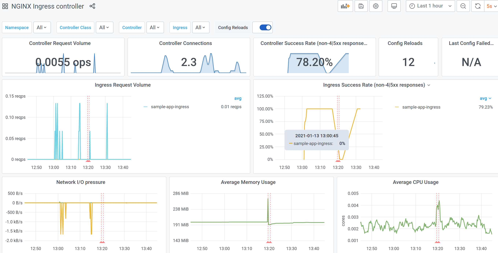

# Exposing your app to the internet

To have your CAST AI hosted application available on the internet you will need to deploy an Ingress.

[Kubernetes documentation - Ingress](https://kubernetes.io/docs/concepts/services-networking/ingress/)

CAST AI clusters are automatically provisioned with:

* Ingress controller and the necessary multi-cloud load balancers infrastructure;
* A certificate manager configured to manage TLS certificates with [letsencrypt.org](https://letsencrypt.org);
* Metric collection for your Ingress traffic;

See [cluster infrastructure](../concepts/cluster-infrastructure.md#ingress) for more details.

Let's deploy, configure, and inspect a basic application: an empty Caddy server.

## Prerequisites

* **CAST AI cluster** - see [create cluster](../getting-started.md).
* **GSLB DNS value of the cluster** - you will find this in [/clusters](../console-overview/console-overview.md#clusters) details page. This will be an internal DNS name for your Ingress.

* **CNAME alias for TLS setup** - use a hostname of your choice and create a CNAME record with GSLB DNS value.

Example if:
| | |
|---|---|
| GSLB DNS value | 1234567890.your-cluster-name-7da6f229.onmulti.cloud |
| Hostname | <https://sample-app.yourdomain.com> |

Then:
| CNAME name | CNAME value|
|---|---|
| sample-app | 1234567890.your-cluster-name-7da6f229.onmulti.cloud |

!!! Note
    Check the DNS resolution (e.g. `dig sample-app.yourdomain.com`) to see that the name resolves to one or more cloud-specific load balancers.

## Deployment

This is a basic setup consisting of 2-replica deployment, a service description for it, and an Ingress resource to publish that service. Change value `sample-app.yourdomain.com` to the DNS CNAME that you have created, and deploy everything else as-is to your cluster.

```yaml
apiVersion: apps/v1
kind: Deployment
metadata:
  name: sample-app
spec:
  replicas: 2
  selector:
    matchLabels:
      app: sample-app
  template:
    metadata:
      labels:
        app: sample-app
    spec:
      containers:
        - name: sample-app
          image: caddy:2.2.1-alpine
          ports:
            - containerPort: 80

---

apiVersion: v1
kind: Service
metadata:
  name: sample-app
spec:
  type: NodePort
  selector:
    app: sample-app
  ports:
    - name: http
      port: 80
      targetPort: 80

---

apiVersion: networking.k8s.io/v1beta1
kind: Ingress
metadata:
  name: sample-app-ingress
  annotations:
    kubernetes.io/ingress.class: "nginx"
    cert-manager.io/cluster-issuer: "letsencrypt-prod"
spec:
  tls:
    - hosts:
        - sample-app.yourdomain.com
      secretName: sample-app
  rules:
    - host: sample-app.yourdomain.com
      http:
        paths:
          - path: /
            backend:
              serviceName: sample-app
              servicePort: http


```

## Verification

Once you deploy the configuration above, the application will be ready for testing in a few moments. Check in the browser or CLI, e.g.:

```console
$ curl -L -I sample-app.yourdomain.com
HTTP/1.1 308 Permanent Redirect
Date: Wed, 13 Jan 2021 11:30:52 GMT
Content-Type: text/HTML
Content-Length: 164
Connection: keep-alive
Location: https://sample-app.yourdomain.com/

HTTP/2 200
date: Wed, 13 Jan 2021 11:30:52 GMT
content-type: text/html; charset=utf-8
content-length: 12226
vary: Accept-Encoding
accept-ranges: bytes
etag: "qlhhn49fm"
last-modified: Thu, 17 Dec 2020 12:35:28 GMT
strict-transport-security: max-age=15724800; includeSubDomains
```

You can see that:

* HTTP->HTTPS redirect is established automatically;
* Once redirected to HTTPS, your application TLS setup works properly (curl is able to verify certificate validity for your domain).

## Deployment without CNAME alias

If you skipped the DNS setup, you will still be able to ping your application and get a response back. The only difference is that the TLS certificate will not be provisioned, as the certificate manager cannot complete an HTTP-01 challenge without LetsEncrypt being able to reach your app via the "official" URL.

To ping the application without a DNS CNAME, use the internal DNS name and pass the "host" header for the Ingress routing to work. You will need to ignore certificate errors, as your application will be using a self-signed certificate as a fallback.

```console
$ curl -s -k -H "Host: sample-app.yourdomain.com" https://1234567890.your-cluster-name-7da6f229.onmulti.cloud | head -n 4
<!DOCTYPE html>
<html>
 <head>
  <title>Caddy works!</title>
```

If you do not intend to create a user-friendly URL, another alternative is to use an internal DNS name as an Ingress host. This will enable the certificate manager to provision a proper TLS certificate and your application will be reachable via this name directly.

```yaml
spec:
  tls:
    - hosts:
        - 1234567890.your-cluster-name-7da6f229.onmulti.cloud
      secretName: sample-app
  rules:
    - host: 1234567890.your-cluster-name-7da6f229.onmulti.cloud
      http:
```

## Metrics

Once the application is up and running you can check the Ingress metrics and dashboard. Go to CAST.AI console [/clusters](../console-overview/console-overview.md#clusters) details page and click on the *"Grafana logs"* link in the side menu. Once in Grafana, click *"Home"* in the top-left corner and open the "NGINX Ingress controller" dashboard. You will see something similar to this:



This dashboard provides an overview of your application traffic. To tailor the dashboard to your specific needs, refer to [NGINX metrics documentation](https://docs.nginx.com/nginx-ingress-controller/logging-and-monitoring/prometheus/) for more details on available metrics.

## Combinations

### Single host, multiple services

You can use path-based routing to redirect traffic to specific services using Ingress rule paths:

[Kubernetes documentation - Ingress path types](https://kubernetes.io/docs/concepts/services-networking/ingress/#path-types)

```yaml
spec:
  rules:
    - host: sample-app.yourdomain.com
      http:
        paths:
          - path: /static
            backend:
              serviceName: static-resources
              servicePort: http
          - path: /
            backend:
              serviceName: base-app
              servicePort: http
```

### Multiple hosts

To manage multiple domains, you can deploy multiple Ingress resources, or include more domains into the same Ingress resource.

```yaml
# first host
apiVersion: networking.k8s.io/v1beta1
kind: Ingress
metadata:
  name: sample-app-ingress
  annotations:
    kubernetes.io/ingress.class: "nginx"
    cert-manager.io/cluster-issuer: "letsencrypt-prod"
spec:
  tls:
    - hosts:
        - sample-app.yourdomain.com
      secretName: sample-app-cert
  rules:
    - host: sample-app.yourdomain.com
      http:
        paths:
          - path: /
            backend:
              serviceName: sample-app
              servicePort: http
---
# second host
apiVersion: networking.k8s.io/v1beta1
kind: Ingress
metadata:
  name: sample-app-ingress2
  annotations:
    kubernetes.io/ingress.class: "nginx"
    cert-manager.io/cluster-issuer: "letsencrypt-prod"
spec:
  tls:
    - hosts:
        - sample-app2.yourdomain.com
      # note that secret needs to be unique for each domain, unless deployments
      # will be separated by kubernetes namespaces
      secretName: sample-app-cert-2  
  rules:
    - host: sample-app2.yourdomain.com
      http:
        paths:
          - path: /
            backend:
              serviceName: sample-app2
              servicePort: http
---

# combining: multiple hosts per certificate and/or multiple certificates per single ingress resource
apiVersion: networking.k8s.io/v1beta1
kind: Ingress
metadata:
  name: sample-app-ingress3
  annotations:
    kubernetes.io/ingress.class: "nginx"
    cert-manager.io/cluster-issuer: "letsencrypt-prod"
spec:
  tls:
    - hosts:
        # two domains under a single certificate
        - sample-app3.yourdomain.com
        - sample-app3-alternative.yourdomain.com
      secretName: sample-app3-cert
    - hosts:
        # another side-by-side certificate
        - sample-app4.yourdomain.com
      secretName: sample-app4-cert
  rules:
    - host: sample-app3.yourdomain.com
      http:
        paths:
          - path: /
            backend:
              serviceName: sample-app
              servicePort: http
    - host: sample-app3-alternative.yourdomain.com
      http:
        paths:
          - path: /
            backend:
              serviceName: sample-app
              servicePort: http
    - host: sample-app4.yourdomain.com
      http:
        paths:
          - path: /
            backend:
              serviceName: sample-app2
              servicePort: http
```
