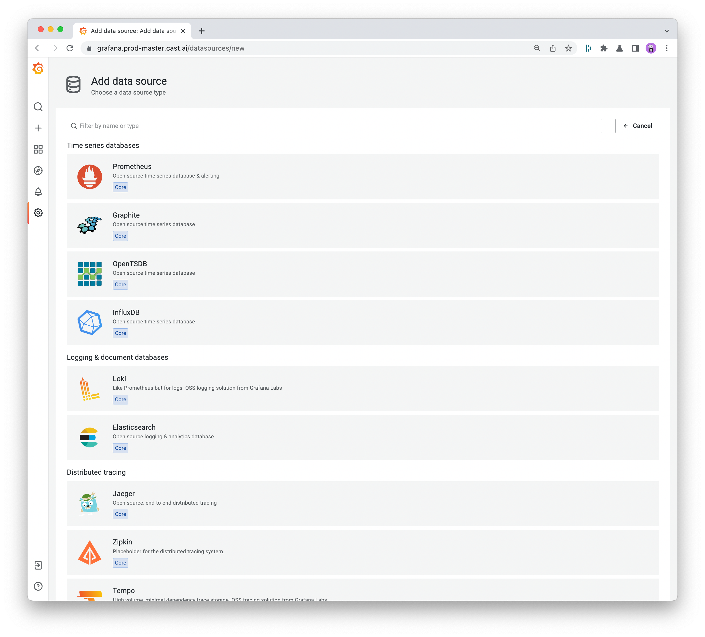
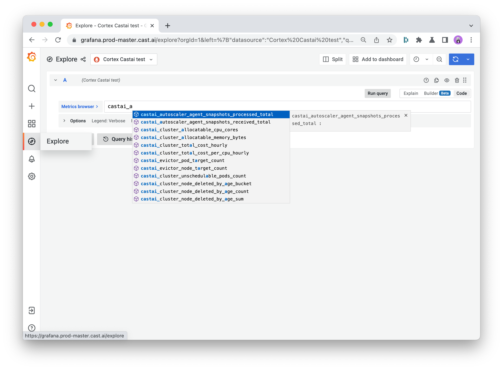
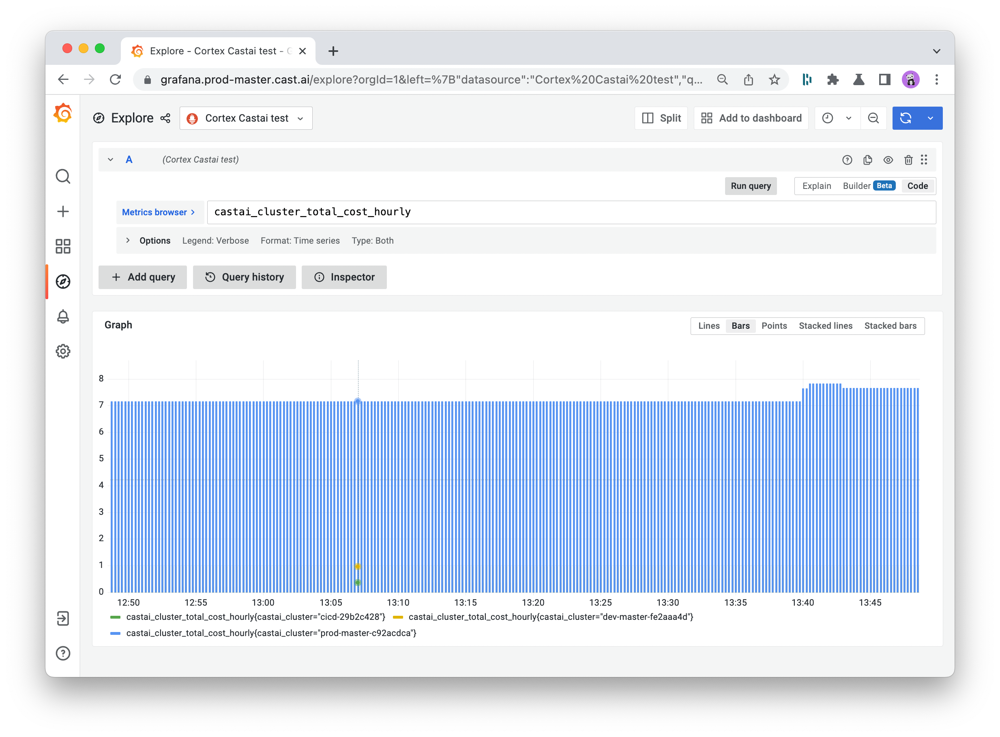
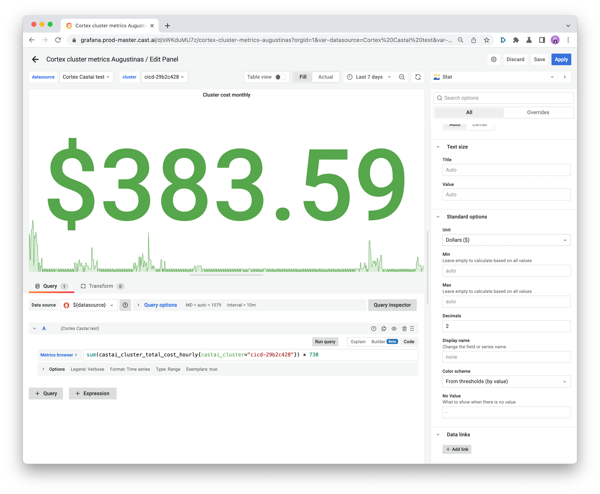
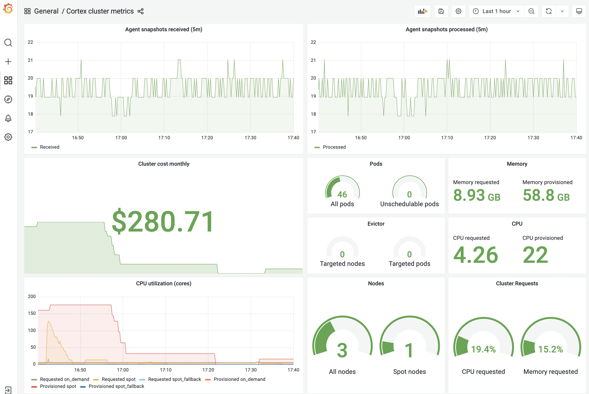

<!-- markdownlint-disable -->
# Cluster metrics integration

CAST AI delivers detailed metrics on your cluster utilization so that you can better understand your cloud infrastructure and ultimately reduce its cost. All metrics are scrapable, so you can scrape the data using Prometheus API and visualize it in Grafana or another tool of your choice.

As a result, you can draw on the cluster utilization and cost stats and include them effortlessly in your team’s wider cloud monitoring and reporting efforts.

This guide outlines the metrics available in CAST AI and describes the process of exporting them to Prometheus and Grafana step by step.

## How to visualize CAST AI metrics in Prometheus and Grafana

### Why use CAST AI with Prometheus and Grafana

The combination of Prometheus and Grafana has become a common choice for DevOps and CloudOps teams, and this is for a reason.

The first provides a powerful querying language and gathers rich metrics, while the latter transforms these into meaningful visualizations. Both Prometheus and Grafana are compatible with most data source types.

### How to connect CAST AI with Prometheus and Grafana

**1. Create your CAST AI API key**

Enter your cluster in the CAST AI platform, click the API tab in the top menu, and generate a one-time token.

You’ll need to specify your key name and choose between a read-only or full access. Then, copy and paste it into the respective place in the above code and execute.

You can also use this key to access CAST AI API in tools like Swagger UI.

**2. Call the CAST AI API**

Open your Prometheus scraper config in your favorite tool and add scraping for CAST AI metrics:

```yaml
scrape_configs:
 2. job_name: 'castai_cluster_metrics'
    scrape_interval: 15s
    scheme: https
    static_configs:
      - targets: ['api.cast.ai']
    metrics_path: '/v1/metrics/prom'
    authorization:
      type: 'Token'
      credentials: '{apiKey}'
```

To access this data endpoint, you’ll need to swap **{apiKey}** for the token created in step 1.

**3. Specify your data source in Grafana**

Open Grafana, head to the Configuration tab, and click on Data Sources.

When you select the Add data source option, you’ll see a list of all supported data sources. From here, choose Prometheus and insert all required details, including HTTP, Auth, and more.



After you specify your data source, you can go to Explore, select your data source by name, and start typing the metric name for autocompleting.





**4. Create a dashboard in Grafana**

Click on the Dashboards tab in Grafana’s main menu and select the Browse option. That’s where you’ll see the button to start a new dashboard. Give it a meaningful name and set the main options.

For more information you can refer to [Grafana’s documentation](https://grafana.com/docs/grafana/latest/dashboards/), you can also check this [list of best practices for creating dashboards](https://grafana.com/docs/grafana/latest/best-practices/best-practices-for-creating-dashboards/).

**5. Add and format your metrics**

Now it’s time to start populating your dashboard with data.

Add a new panel and scroll down to its bottom to ensure that the data source is set to Prometheus. Then, start typing the name of the required metric in the metric browser box, and it will appear on the screen.

Common choices of metrics include the requested vs. provisioned CPUs and memory, and the monthly cost of your cluster. You can also expand the metrics presented in your dashboard by importing data in JSON files.



Use the panel on the right to specify your stat title, legend, visualization styles, and other values to help you ensure the report makes the most sense to your team.

You can then expand your dashboard with additional features, including [annotations](https://grafana.com/docs/grafana/latest/dashboards/annotations/) and [alerts](https://grafana.com/docs/grafana/latest/alerting/).

### Example Grafana dashboard

Here’s an example dashboard displaying CAST AI data.



You can get the [code here](https://docs.cast.ai/assets/example-metrics-dashboard.json).

## CAST AI metrics

**Note:** Label `cast_node_type` is deprecated, so instead of it please use `castai_node_lifecycle`.

| Name                                                | Type    | Description                                                                                                                    | Action                                        |
| :-------------------------------------------------- | ------- | ------------------------------------------------------------------------------------------------------------------------------ | --------------------------------------------- |
| `castai_autoscaler_agent_snapshots_received_total`  | Counter | The CAST AI Autoscaler agent snapshots received total.                                                                         | Check if the Agent is running in the cluster. |
| `castai_autoscaler_agent_snapshots_processed_total` | Counter | The CAST AI Autoscaler agent snapshots processed total.                                                                        | Contact CAST AI support.                      |
| `castai_cluster_total_cost_hourly`                  | Gauge   | Cluster total hourly cost.                                                                                                     |                                               |
| `castai_cluster_compute_cost_hourly`                | Gauge   | Cluster compute cost. Has a `lifecycle` dimensions which can be summed up to a total cost: `[on_demand, spot_fallback, spot]`. |                                               |
| `castai_cluster_compute_cost_per_cpu_hourly`        | Gauge   | Normalized cost per CPU. Has a `lifecycle` dimension, similar to `castai_cluster_compute_cost_hourly`.                         |                                               |
| `castai_cluster_allocatable_cpu_cores`              | Gauge   | Cluster allocatable CPU cores.                                                                                                 |                                               |
| `castai_cluster_allocatable_memory_bytes`           | Gauge   | Cluster allocatable memory.                                                                                                    |                                               |
| `castai_cluster_provisioned_cpu_cores`              | Gauge   | Cluster provisioned CPU cores.                                                                                                 |                                               |
| `castai_cluster_provisioned_memory_bytes`           | Gauge   | Cluster provisioner memory.                                                                                                    |                                               |
| `castai_cluster_requests_cpu_cores`                 | Gauge   | Cluster requested CPU cores.                                                                                                   |                                               |
| `castai_cluster_requests_memory_bytes`              | Gauge   | Cluster requested memory.                                                                                                      |                                               |
| `castai_cluster_node_count`                         | Gauge   | Cluster nodes count.                                                                                                           |                                               |
| `castai_cluster_pods_count`                         | Gauge   | Cluster pods count.                                                                                                            |                                               |
| `castai_cluster_unschedulable_pods_count`           | Gauge   | Cluster unschedulable pods count.                                                                                              |                                               |
| `castai_evictor_node_target_count`                  | Gauge   | CAST AI Evictor targeted nodes count.                                                                                          |                                               |
| `castai_evictor_pod_target_count`                   | Gauge   | CAST AI Evictor targeted pods count.                                                                                           |                                               |

## Query examples

**Cost per cluster:**

```
sum(castai_cluster_total_cost_hourly{}) by (castai_cluster)
```

**Compute cost of spot instances of a specific cluster:**

```
castai_cluster_compute_cost_hourly{castai_cluster="$cluster", lifecycle="spot"}
```

**Received snapshots count:**

```
sum(increase(castai_autoscaler_agent_snapshots_received_total{castai_cluster="$cluster"}[5m]))
```

**Alert on missing snapshots:**

```
absent_over_time(castai_autoscaler_agent_snapshots_received_total{castai_cluster="$cluster"}[5m])
```

**Get castai_node_lifecycle(`on_demand`, `spot`, `spot_fallback`) of running nodes in cluster:**

```
sum(castai_cluster_node_count{castai_cluster="$cluster"}) by (castai_node_lifecycle)
```

**Get CPU cores provisioned for `spot_fallback` nodes:**

```
castai_cluster_provisioned_cpu_cores(castai_node_lifecycle="spot_fallback")
```

**Note**: Replace `$cluster` with existing `castai_cluster` label value.
<!-- markdownlint-enable-->
