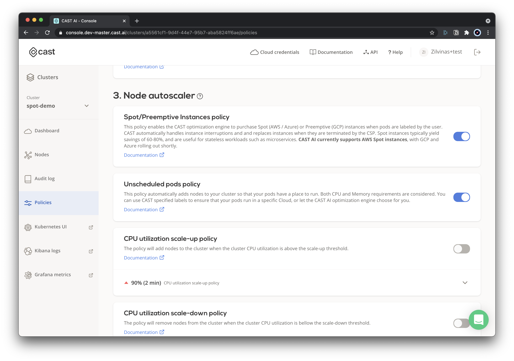
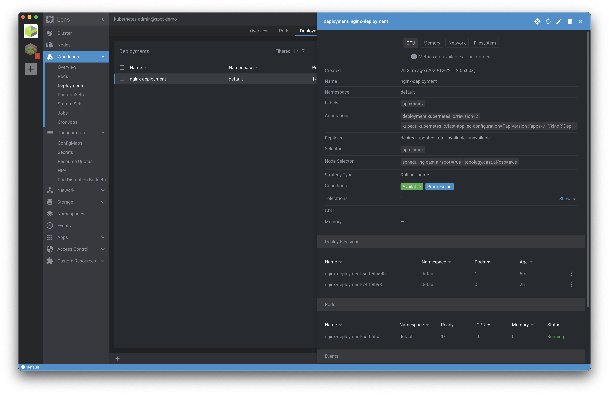
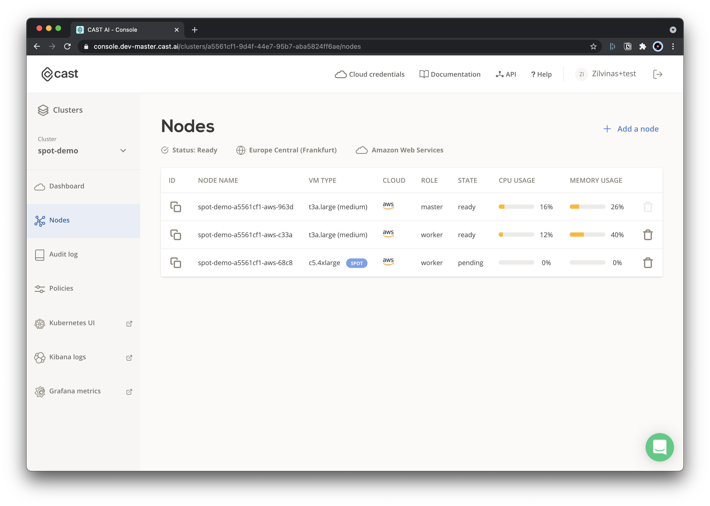
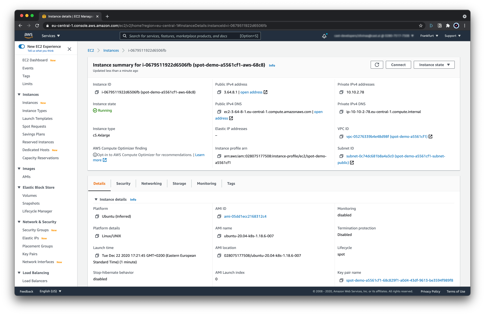

# Spot/Preemptible Instances

The CAST AI autoscaler supports running your workloads on Spot/Preemtible instances.
In this guide, we will show you just how easy it is to do that.

## Available configurations

### Tolerations

**When to use:** spot instances are optional

When a pod is marked only with `tolerations`, the Kubernetes scheduler could place such a pod/pods on regular nodes as well.

```yaml
...
tolerations:
  - key: scheduling.cast.ai/spot
    operator: Exists
...
```

### Node Selectors

**When to use:** only use spot instances

If you want to make sure that a pod is scheduled on spot instances only, add `nodeSelector` as well as per example below.
The autoscaler will then ensure that only a spot instance is picked whenever your pod requires additional workload in the cluster.

```yaml
...
tolerations:
  - key: scheduling.cast.ai/spot
    operator: Exists
nodeSelector:
  scheduling.cast.ai/spot: "true"
...
```

## Step-by-step deployment on Spot Instance

In this step-by-step guide, we demonstrate how to use Spot Instances with your CAST AI clusters.

To do that, we will use an example NGINX deployment configured to run only on Spot/Preemtible instances.

### 0. Pre-requisites

- **CAST AI cluster** - see [create cluster](../getting-started.md).
- **`Kubeconfig` file** - see [deploy application](../getting-started.md#deploy-application)

### 1. Enable relevant policies

To get started on using Spot instances autoscaler enable two policies under `Policies` menu in the UI:

* **Spot/Preemptible instances policy**
  * This policy allows the autoscaler to use spot instances
* **Unschedulable pods policy**
  * This policy requests an additional workload to be scheduled based on your deployment requires (i.e. run on spot instances)



### 2. Example deployment

Save the following _yaml_ file, and name it: `nginx.yaml`:

```yaml
apiVersion: apps/v1
kind: Deployment
metadata:
  name: nginx-deployment
  labels:
    app: nginx
spec:
  replicas: 1
  selector:
    matchLabels:
      app: nginx
  template:
    metadata:
      labels:
        app: nginx
    spec:
      nodeSelector:
        scheduling.cast.ai/spot: "true"
        topology.cast.ai/csp: "aws"
      tolerations:
        - key: scheduling.cast.ai/spot
          operator: Exists
      containers:
        - name: nginx
          image: nginx:1.14.2
          ports:
            - containerPort: 80
          resources:
            requests:
              cpu: '2'
            limits:
              cpu: '3'
```

#### 2.1. Apply the example deployment

With `kubeconfig` set in your current shell session, you can execute the following (or use other means of applying deployment files):

`kubectl apply -f ngninx.yaml`



#### 2.2. Wait several minutes

Once the deployment is created, it will take up to several minutes for the autoscaler to pick up the information about your pending deployment and schedule the relevant workloads in order to satisfy the deployment needs, such as:

* This deployment **tolerates spot instances**
* This deployment **must run only on spot instances**

### 3. Spot Instance added

* You can see your newly added spot instance in the cluster node list.



### 3.1. AWS instance list

Just to double check, go to AWS console and check that the added node has the `Lifecycle: spot` indicator.


