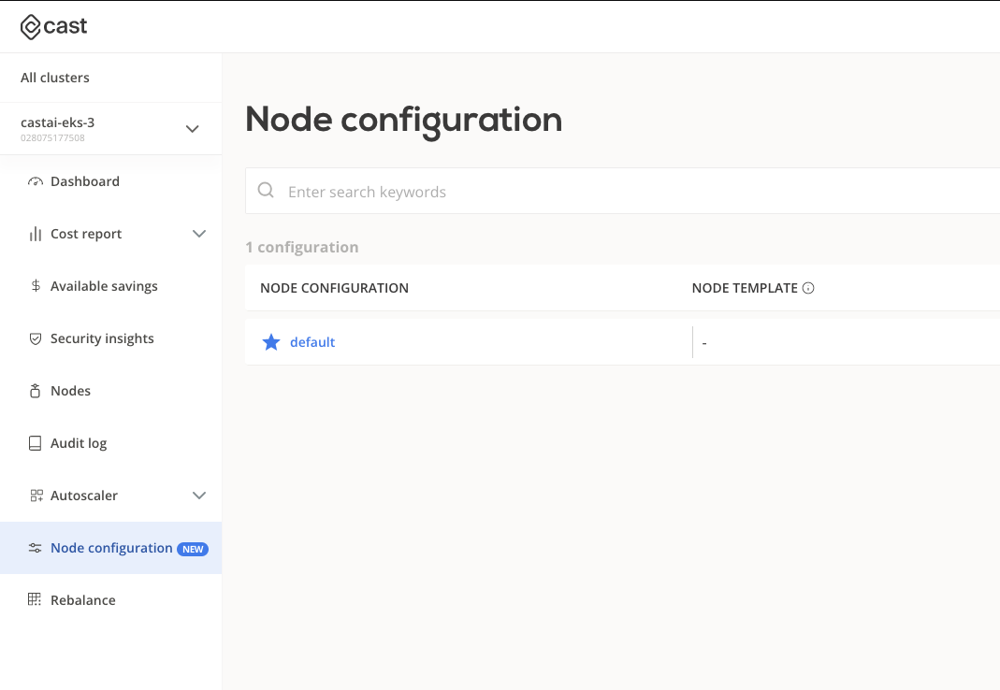
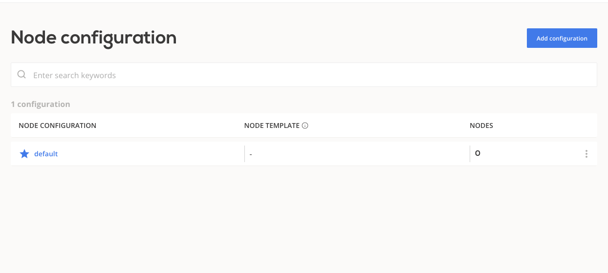
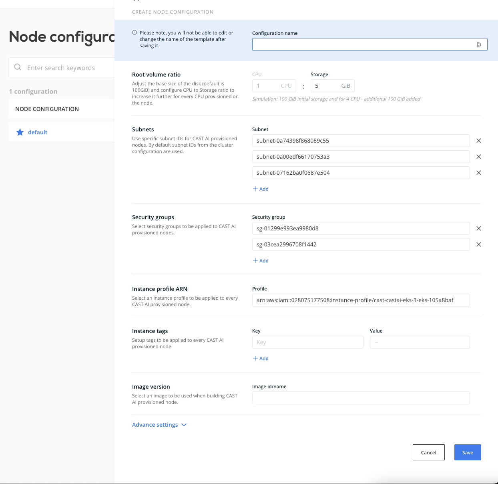
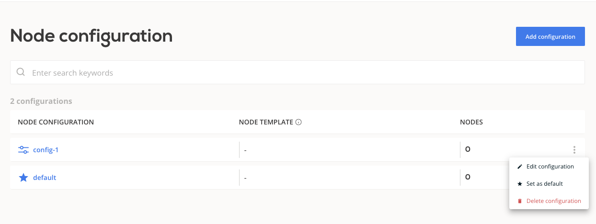
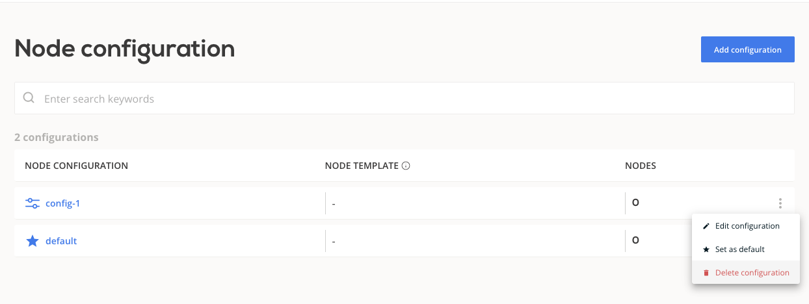
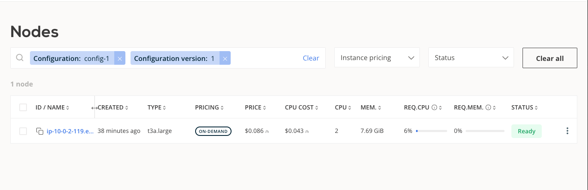

# Node Configuration

## Feature availability

| EKS | KOPS | GKE | AKS |
| --- | ---- | --- | --- |
| **+** |  -   |  -  |  -  |
| **+** |  -   |  -  |  -  |

The CAST AI provisioner allows you to provide node configuration parameters
that will be applied to CAST AI provisioned nodes.
Node configuration on its own does not influence workload placement.

The list of supported configuration parameters:

| Configuration         | Options |
|-----------------------|---------|
| Root volume ration    | CPU to storage (GiB) ratio |
| Subnets               | Subnet IDs for CAST AI provisioned nodes |
| Security groups       | Security group IDs for CAST AI provisioned nodes |
| Instance profile ARN  |  Instance profile ARN for CAST AI provisioned nodes |
| Instance tags         | Tags for CAST AI provisioned nodes |
| Image version         | Image to be used when building CAST AI provisioned node |
| Dns-cluster-ip        | Override the IP address to be used for DNS queries within the cluster |
| SSH key               | Base64 encoded public key or AWS key ID |

By default values are either inferred from the cluster (subnets, security groups...) or a generic value is applied.

Some configuration options are cloud provider specific, see table below:

### Shared configuration options

| Configuration        | Default value  |
|----------------------|----------------|
| Root volume ration   |  1 CPU : 5 GiB |
| Image version        | Latest available [AMI](https://docs.aws.amazon.com/eks/latest/userguide/eks-optimized-ami.html) for kubernetes release |
| SSH key              | ""             |


### EKS configuration options

| Configuration        | Default value |
|----------------------|---------------|
| Subnets              | All subnets pointing to NAT/Internet Gateways inside cluster VPC |
| Security groups      | [Tagged](https://docs.aws.amazon.com/eks/latest/userguide/sec-group-reqs.html) and CAST AI SG |
| Instance profile ARN | cast-<cluster-name\>-eks-<cluster-id\> (only last 8 digits of cluster ID) |
| Instance tags        | []            |
| Dns-cluster-ip       | ""            |

## Create node configuration

A default node configuration is created during phase 2 cluster onboarding.
You can choose to modify this configuration or create a new one.
If you choose to add new node configuration that will be applied to all newly
provisioned nodes, you will have to mark it as the default node configuration.

Node configurations are versioned and when the CAST AI provisioner adds new node,
the latest version of node configuration is applied. Over time CAST AI provisioned
nodes trend to the latest available node configuration.

### Create node configuration in CAST AI Console

In the cluster view a new tab "Node configuration" has been created.
Here you can view and manage node configurations.



 1. Use the button "Add configuration"

    

 2. Name your configuration and fill in your values

    

 3. Click "Save"

 4. Click "..." and "Set as default"

    

### Create node configuration with CAST AI Terraform provider

Use the resource `castai_node_configuration` from [CAST AI terraform provider](https://github.com/castai/terraform-provider-castai).

Reference example:

```hcl
resource "castai_node_configuration" "test" {
  name           = local.name
  cluster_id     = castai_eks_cluster.test.id
  disk_cpu_ratio = 35
  subnets        = aws_subnet.test[*].id
  tags           = {
    env = "development"
  }
  eks {
    instance_profile_arn = aws_iam_instance_profile.test.arn
    dns_cluster_ip       = "10.100.0.10"
    security_groups      = [aws_security_group.test.id]
  }
}
```

### Create node configuration with CAST AI API

For API operations consult the generated [documentation](https://api.cast.ai/v1/spec/#/NodeConfigurationAPI).

## Delete node configuration

To delete a node configuration, the following has to be true:

* the configuration is not linked to a node template
* if the configuration is marked as "default", it must not be the latest version

### Delete node configuration in CAST AI Console

In the node configuration view, click "..." of the configuration you wish to delete
and then "Delete configuration".



## Node view

In the "Nodes" tab, you can view and filter nodes based on applied node configuration:


