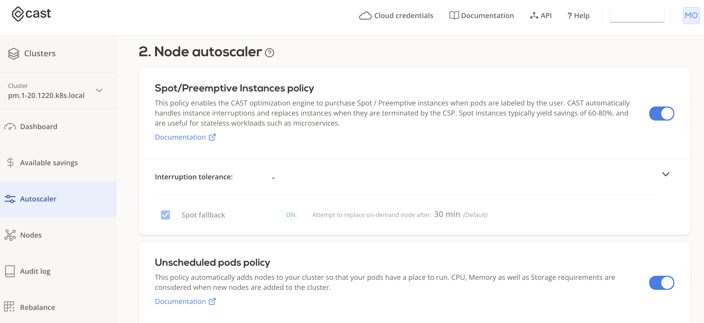
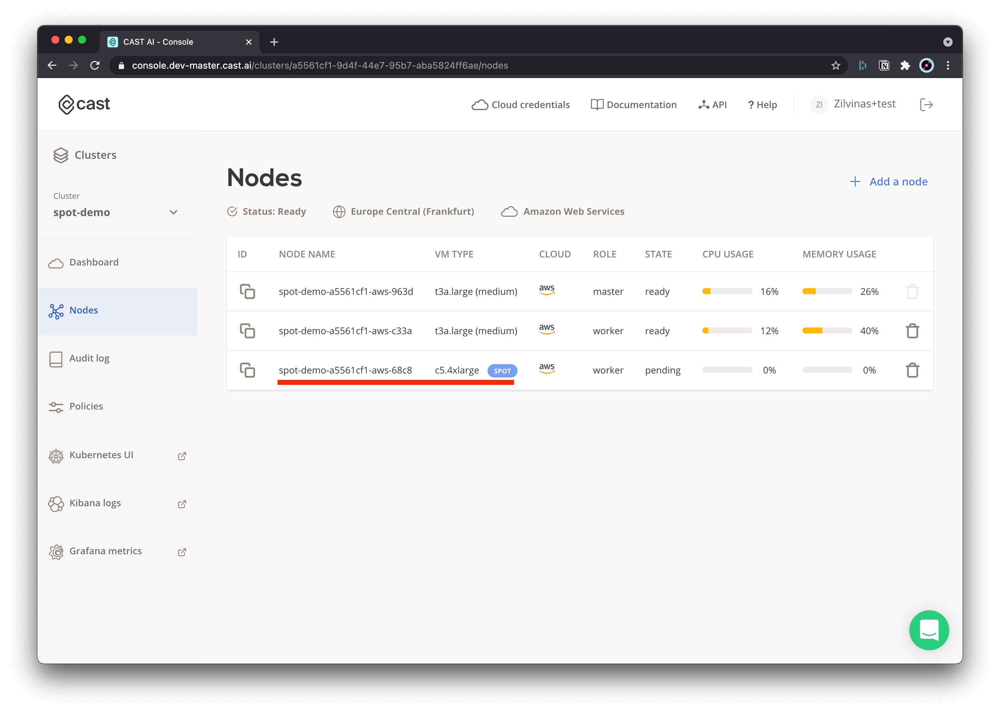
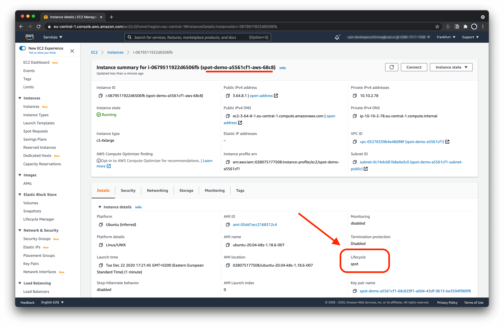

# Spot/Preemptible Instances

The CAST AI autoscaler supports running your workloads on Spot/Preemptible instances.
This guide will help you configure and run it in 5 minutes.

## Available configurations

### Tolerations

**When to use:** spot instances are optional

When a pod is marked only with `tolerations`, the Kubernetes scheduler could place such a pod/pods on regular nodes as well.

```yaml
tolerations:
  - key: scheduling.cast.ai/spot
    operator: Exists
```

### Node Selectors

**When to use:** only use spot instances

If you want to make sure that a pod is scheduled on spot instances only, add `nodeSelector` as well as per the example below.
The autoscaler will then ensure that only a spot instance is picked whenever your pod requires additional workload in the cluster.

```yaml
tolerations:
  - key: scheduling.cast.ai/spot
    operator: Exists
nodeSelector:
  scheduling.cast.ai/spot: "true"
```

### Node Affinity

**When to use:** spot instances are preffered, however if they are not available use on-demand node

In case when spot instance is interrupted, however on-demand nodes in the cluster have available capacity, pods that previously ran on spot instance would be scheduled on available on-demand nodes if following affinity rule is applied:

```yaml
spec:
  affinity:
    nodeAffinity:
      preferredDuringSchedulingIgnoredDuringExecution:
      - weight: 1
        preference:
          matchExpressions:
          - key: scheduling.cast.ai/spot
            operator: Exists
```

### Spot Reliability

**When to use:** there's a need to minimize workload interruptions

Autoscaler is able to identify which instance types are less likely to be interrupted. You can set a default reliability value cluster-wide in [spot instance policy](autoscaling-policies.md#spotpreemptive-instances-policy). If you want to control that per-workload, e.g. leave most const-efficient value globally and only choose more stable instances for specific pods, define this in deployment configuration by setting `scheduling.cast.ai/spot-reliability` label on the pod.

Here's an example how it's done for the typical deployment:

```yaml
spec:
  template:
    metadata:
      labels:
        scheduling.cast.ai/spot-reliability: 10
```

Reliability is measured by "what is the percentage of reclaimed instances during trailing month for this instance type". This tag specifies an upper limit - all instances below specified reliability value will be considered.

The value is a percentage (range is 1-100), and the meaningful values are:

- `5`: most reliable category; by using this value you'll restrict autoscaler to use only the narrowest set of spot instance types
- `10` - `15`: reasonable value range to compromise between reliability and price;
- `25` and above: typically most instances fall into this category,.

!!! tip ""
    For AWS, have a look at [Spot instance advisor](https://aws.amazon.com/ec2/spot/instance-advisor/) to get an idea which instances correspond to which reliability category.

## Step-by-step deployment on Spot Instance

In this step-by-step guide, we demonstrate how to use Spot Instances with your CAST AI clusters.

To do that, we will use an example NGINX deployment configured to run only on Spot/Preemptible instances.

### 0. Pre-requisites

- **CAST AI cluster** - see [create cluster](../getting-started/create-cluster.md).
- **`Kubeconfig` file** - see [deploy application](../getting-started/deploy-application.md)

### 1. Enable relevant policies

To start using Spot instances autoscaler enable the following policies under the `Policies` menu in the UI:

- **Spot/Preemptible instances policy**
    - This policy allows the autoscaler to use spot instances

- **Unschedulable pods policy**
    - This policy requests an additional workload to be scheduled based on your deployment requirements (i.e. run on spot instances)



### 2. Example deployment

Save the following _yaml_ file, and name it: `nginx.yaml`:

```yaml
apiVersion: apps/v1
kind: Deployment
metadata:
  name: nginx-deployment
  labels:
    app: nginx
spec:
  replicas: 1
  selector:
    matchLabels:
      app: nginx
  template:
    metadata:
      labels:
        app: nginx
    spec:
      nodeSelector:
        scheduling.cast.ai/spot: "true"
      tolerations:
        - key: scheduling.cast.ai/spot
          operator: Exists
      containers:
        - name: nginx
          image: nginx:1.14.2
          ports:
            - containerPort: 80
          resources:
            requests:
              cpu: '2'
            limits:
              cpu: '3'
```

#### 2.1. Apply the example deployment

With `kubeconfig` set in your current shell session, you can execute the following (or use other means of applying deployment files):

`kubectl apply -f ngninx.yaml`


#### 2.2. Wait several minutes

Once the deployment is created, it will take up to several minutes for the autoscaler to pick up the information about your pending deployment and schedule the relevant workloads in order to satisfy the deployment needs, such as:

- This deployment **tolerates spot instances**
- This deployment **must run only on spot instances**

### 3. Spot Instance added

- You can see your newly added spot instance in the cluster node list.



### 3.1. AWS instance list

Just to double-check, go to the AWS console and check that the added node has the `Lifecycle: spot` indicator.


