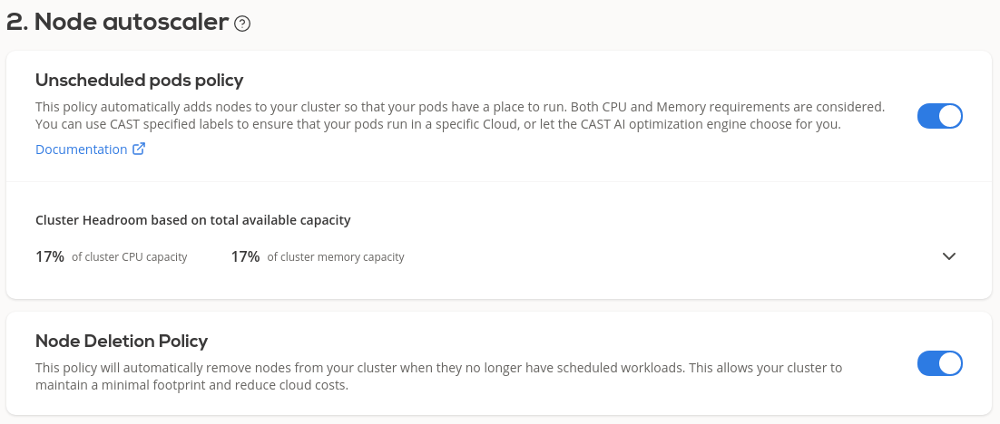
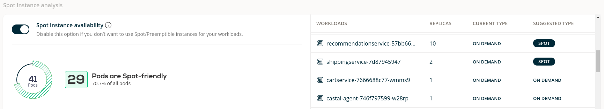

# Start saving on your connected EKS cluster immediately

So, you liked the results of the Savings Estimator after connecting your existing EKS cluster to CAST AI, but don't
want to wait until these savings reach you in a slow and risk-free ongoing process. You can speed this up, here's how.

## Onboard credentials (EKS)

First, you need to [onboard the credentials](../getting-started/eks/eks.md#credential-onboarding) so IAM user for CAST AI gets created and cluster can be optimized using CAST AI policies.

## Enable Autoscaler

1. **Enable Node deletion** policy - this policy will remove nodes without pods (ignores DaemonSets).

2. **Enable Unscheduled Pod** policy - it will make sure that you always have the capacity in the cluster to run pods. The Unscheduled
Pod policy will provision a new node when required, taking no more than 2-3 minutes.

3. **Enable and adjust Node constraints %** sub-policy of Unscheduled pods policy. for migration purposes - each node adds overhead through DaemonSets, also more smaller nodes means that more pods won't find their destination on the same node (added latency). So ideally, one should have nodes that are as large as possible, but 5-6 nodes minimum (for
below 200 CPUs cluster) for good SLA and adequate capacity distribution for the lifecycle process (upgrades, patching). Take
the number from Available Savings - this is the total amount of nodes you should have in the optimized state.


In the Policies tab, it should look like this:



## "Slow and safe" or "maximize savings now"

Evictor is our recommended way - it will constantly look for inefficiencies. But reducing costs in a safe manner takes
time. If you want to maximize your savings as quickly as possible and you have a maintenance window, you can do it in CAST AI.

### Install Evictor

Evictor will compact your pods into fewer nodes, creating empty nodes that will be removed by the Node deletion policy. Install and configure Evictor using this [guide](../guides/evictor.md) then complete remaining steps listed below.

### Stir the pod with manual migration

You will have to get rid of your existing nodes and let CAST AI create an optimized state right away. This might cause some
downtime depending on your workload configuration.

For example, pick 50% of your nodes in one availability zone (AZ) or 20% of nodes if your connected cluster is in a single AZ.

```
kubectl get nodes -Lfailure-domain.beta.kubernetes.io/zone --selector=eks.amazonaws.com/nodegroup-image
```

The percentage is arbitrary - it depends on your risk appetite and how much time you want to spend on this. Taint (cordon)
the selected nodes, so no new pods are placed on these nodes. We like Lens Kubernetes IDE, but you can use kubectl as
well:

```
kubectl cordon nodeName1
kubectl cordon nodeName2
```

And now drain these nodes:

```
kubectl drain nodeName1 --ignore-daemonsets --delete-local-data
kubectl drain nodeName2 --ignore-daemonsets --delete-local-data
```

Some nodes will not drain because of the Disruption Budget violation (downtime). These cases should be fixed since they are going to
cause pain in the future (or at least noted to be addressed at a more convenient time). If you want to progress anyway and accept
downtime, cancel the drain command and retry draining with the additional --force flag.

You should see that the drained nodes disappear (empty Node deletion policy) and, in few moments, new nodes in the same
availability zone appear (Unscheduled Pod policy).

Check the remaining nodes. You will see that list is shorter because the command below selects only nodes in the AWS autoscaling
group (ASG) and new nodes don't use ASG.

```
kubectl get nodes -Lfailure-domain.beta.kubernetes.io/zone --selector=eks.amazonaws.com/nodegroup-image
```

Select next batch -> cordon -> drain -> write down problematic pod that don't migrate easily -> rinse and repeat until the
list is empty.

### Utilize Spot instances

In the Available savings window, you can find a list of deployments that could use Spot instances. I have a recommendation
service running with 10 replicas.



I could separate this workload into two deployments:

1. Reduce the current replica count to a bare minimum (in my case, 2 replicas),
2. Create a copy of deployment with "-spot" appending name, add toleration, and set to 8 replicas - or better, configure to
use KEDA, see [HPA documentation](../guides/hpa.md)

```yaml
...
tolerations:
  - key: scheduling.cast.ai/spot
    operator: Exists
...
```

### You're all done

- Share the Available savings window screenshot with your CFO/manager - there's nothing left to save.

- Install Evictor if you haven't already done that.
