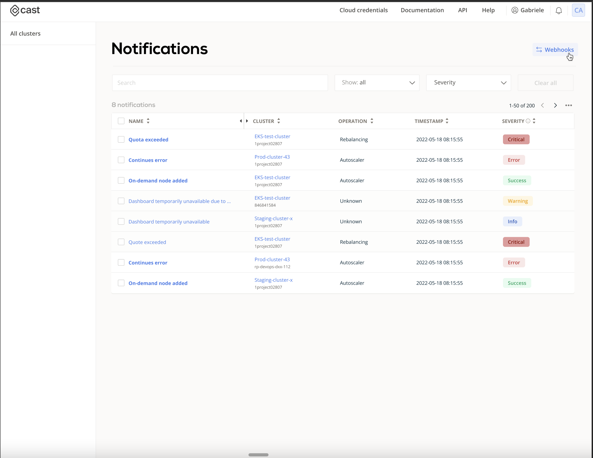

# How to setup Notification Webhooks

To send notifications from CAST AI Console to a external system, go to the organization you want to configure the webhook and then notifications.



## Request Template Configuration

We allow users to fully customize the request sent to external systems, in that way we can support almost any application out there. The Request Template is the payload send within the webhook call, the following variables from notifications are avaialable:

| Variable                   | Description                                                                                     | Usage                             |
| -------------------------- | ----------------------------------------------------------------------------------------------- | --------------------------------- |
| NotificationID             | The UUID of the notification, it is unique                                                      | {{ .NotificationID }}             |
| OrganizationID             | Organization that owns the notification                                                         | {{ .OrganizationID }}             |
| Severity                   | Indicates the severity of the impact to the affected system.                                    | {{ .Severity }}                   |
| Name                       | Name of the notification                                                                        | {{ .Name }}                       |
| Message                    | A high-level, text summary message of the event.                                                | {{ .Message}}                     |
| Details                    | Free-form details from the event, can be parsed to JSON                                         | {{ toJSON .Details }}             |
| Timestamp                  | When the Notification was created by CAST AI                                                    | {{ .toISO8601 .Timestamp }}       |
| Cluster                    | Cluster information, could be empty                                                             | {{ toJSON .Cluster }}             |
| Cluster.ID                 | The unique identifier of the cluster on CAST AI                                                 | {{ .Cluster.ID }}                 |
| Cluster.Name               | Name of the cluster on CAST AI                                                                  | {{ .Cluster.Name }}               |
| Cluster.ProviderType       | Cloud provider of the cluster (eks, gke, aks, kops)                                             | {{ .Cluster.ProviderType }}       |
| Cluster.ProjectNamespaceID | Cluster location where cloud provider organizes resources, eg.: GCP project ID, AWS account ID. | {{ .Cluster.ProjectNamespaceID }} |

As you can see the variables are in go template style, and you can mix them anywhere you want in your Request Template.

## Example of Request Template Slack

To send a notification on slack we need a simple JSON request with payload in the body,

```json
{
    "text": "CAST AI - {{ .Name }}",
    "blocks": [
     {
      "type": "section",
      "text": {
       "type": "mrkdwn",
       "text": "{{ .Cluster.Name }}<br> {{ .Message}}"
      }
     }
    ]
}
```

How to create the webhook url isn't in the scope of this how to, you can find information following the link <https://api.slack.com/messaging/webhooks>.

## Example of Request Template PageDuty

Page duty accepts Alerts in the endpoint `https://events.pagerduty.com/v2/enqueue`. The content is a simple JSON request with the payload in the body. You can find bellow an example of request template with the available variables:

```json
{
    "payload": {
        "summary": "{{ .Message }}",
        "timestamp": "{{ toISO8601 .Timestamp }}",
        "severity": "critical",
        "source": "CAST AI",
        "component": "{{ .Cluster.Name}}-{{ .Cluster.ProviderType}}-{{ .Cluster.ProjectNamespaceID }}",
        "group": "{{ .Name }}",
        "class": "kubernetes",
        "custom_details": {{ toJSON .Details }}
    },
    "routing_key": "--routing_key--",
    "dedup_key": "{{ .NotificationID }}",
    "event_action": "trigger",
    "client": "CAST AI",
    "client_url": "https://console-filipe.localenv.cast.ai/external-clusters/{{ .Cluster.ID}}?org={{ .OrganizationID }}",
}
```

Note that as `dedup_key` it was set the NotificationID, this field is unique in CAST AI, and will ensure you won't produce an alert with the same content more than once.

How to create the `routing_key` isn't in the scope of this how to, you can find more information at <https://developer.pagerduty.com/docs/ZG9jOjExMDI5NTgx-send-an-alert-event.>
