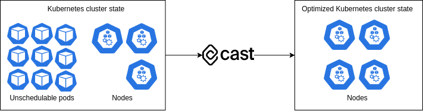

# CAST AI autoscaling engine

## Introduction

Autoscaler is a CAST AI tool built to scale Kubernetes clusters with cost efficiency as the main objective. It's goal is to dynamically adjust the count of nodes by adding new right-sized nodes and removing underutilized nodes when:

* There are pods which are unschedulable due to insufficient resources in the cluster.
* There are empty nodes which have not been utilized for a certain period of time.

Autoscaler works by **watching** your cluster state with the help of the [CAST AI Kubernetes Agent](https://github.com/castai/k8s-agent), which syncs cluster state changes to CAST AI. Autoscaler then **calculates** the required extra cluster capacity and **detects** empty nodes. The extra capacity is **evaluated** and converted into **optimal** node instance types. New optimal nodes are then **provisioned** while the underutilized empty nodes are **removed**.

## Concepts

* **Unschedulable pods**: Kubernetes pods that are in the `Pending` phase and their condition `PodScheduled` is `False` with reason `Unschedulable`.
* **Pod constraints**: Kubernetes pods can be declared with node selectors, node affinity and pod anti/affinity properties, which reduce the number of node types and topology, i.e. the hardware and zonal placement, that could satisfy the pod.
* **Kubernetes scheduler**: The Kubernetes scheduler is a control plane process which assigns pods to nodes.
* **Empty node**: A node that does not have any pods running on them. Exited, static or `DaemonSet` pods are ignored.

## Cluster state

Autoscaler needs the cluster state to optimize the cluster. The [CAST AI Kubernetes Agent](https://github.com/castai/k8s-agent) is responsible for collecting all cluster state changes and sending them to the Autoscaler. It watches the Kubernetes resources with the [Kubernetes informers](https://pkg.go.dev/k8s.io/client-go/informers) package and syncs all changes to CAST AI in regular `15s` intervals.

List of resources watched by the Kubernetes Agent, required to correctly apply autoscaling decisions by the Autoscaler:

* `Node`
* `Pod`
* `PersistentVolume`
* `PersistentVolumeClaim`
* `ReplicationController`
* `Service`
* `Deployment`
* `ReplicaSet`
* `DaemonSet`
* `StatefulSet`
* `StorageClass`
* `Job`
* `CSINode`

## Cluster upscaling

Autoscaler adds new nodes when it detects unschedulable pods. Pods become unschedulable when the Kubernetes scheduler fails to place them on any node. The Kubernetes scheduler has various node filters which are applied when deciding the scheduling outcome. If any of them fail, the pod is marked as unschedulable. For example: none of the nodes could fit the pod, or none of the nodes match the pod's constraints.

### Bin-packing

Autoscaler calculates the required extra capacity based on the unschedulable pod count and their requested resources. Autoscaler uses bin-packing algorithms to find the most optimal pod groupings. Some pods cannot be placed on the same node because of their declared constraints. The goal of bin-packing is to find all the possible groupings. Bin-packing is considered a [P versus NP problem](https://en.wikipedia.org/wiki/P_versus_NP_problem), therefore, as the number of unschedulable pods increases, the Autoscaler will start adding various approximation strategies to keep the time of the algorithm consistent. High level diagram of a bin-packing algorithm:

### Instance type choosing

Autoscaler converts the bin-packed pod groups into instance types. The goal when choosing an instance type is to find the cheapest one which matches all constraints. First, the Autoscaler filters the list of all instance types and chooses only those that are viable. Then it will sort them by their price and chooses the cheapest one. This always results in the most optimal node.

Instance type pricing and availability is updated regularly and often by scraping cloud service provider APIs. So, the Autoscaler completely removes the need for humans to track the pricing and to analyze viable instance type offerings.

If pods have no constraints defined, the Autoscaler is free to choose out of a vast instance type offering list. However, there are often cases where a pod needs to define constraints due to high-availability or hardware requirements. To find out more about how to take control visit the [Pod placement](../../guides/pod-placement.md) section. Also, CAST AI has full support for spot instance scaling. Visit the [Spot/Preemtible instances](../../guides/autoscaling-policies.md#spotpreemptive-instances-policy) section to find how you can start using spot instances.

## Cluster downscaling

Autoscaler removes nodes when it detects that nodes which were not utilized for a certain period of time. The goal of removing empty nodes is to save costs and reduce waste. Autoscaler only removes **empty** nodes. Nodes end up empty because all pods running on the node have been deleted, possibly due to `ReplicaSet` scale down or `Job` completion. Another CAST AI component which helps to bin-pack running pods in order to consolidate them into fewer nodes is the [Evictor](../../guides/evictor.md).
