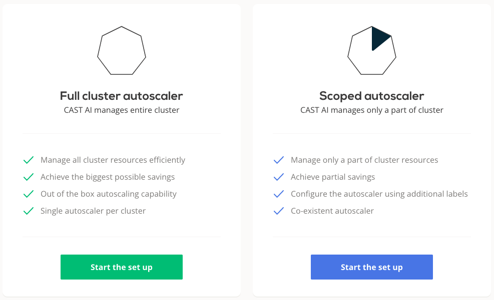

# Autoscaler

  CAST AI autoscaler automates the process of upscaling and downscaling the cluster. Autoscaling decisions are based on configured settings and policies. Ultimately autoscaler will help you optimize your cluster and reduce the cloud bill.

## Autoscaling modes

Users who have connected an external cluster to CAST AI have two options how to use the autoscaler.

  **Scoped autoscaler** - is a mode of operations where CAST AI autoscaler co-exists with other autoscaler(s) on the same cluster and is managing only specific workloads. In order to restrict the scope of the autoscaler, workloads have to be modified as prescribed in this [guide](/guides/autoscaling-policies/#scoped-autoscaler-mode).

  Scoped autoscaler will not ensure that all workloads on the cluster have capacity to run and advanced features like Rebalancer are not available in this mode. Due to these limitations we recommend using CAST AI autoscaler as the only autoscaler on the cluster (i.e. in the full autscaling mode).

  **Full autoscaler** - this is our recommended mode of operations when CAST AI autoscaler is managing the whole cluster and all workloads. It is also the only way how autoscaler works on clusters created in CAST AI.

## Overview of autoscaler policies

Bellow is the list of policies that control the autoscaler.

??? tldr "1. Cluster limits"
    **Cluster limits** - policies that limit the cluster scale to the defined limits. This policy has the highest priority, and all the other policies cannot scale the cluster over the defined limits.

       - **CPU policy** - This policy ensures that your cluster stays within the defined CPU minimum and maximum counts. Use this policy to create a guardrail against unexpected costs, in cases where traffic or workload requirements grow beyond budget expectations.

??? tldr "2. Node autoscaler"
    **Node autoscaler** - policies to scale cluster based on the CPU or memory demand

       - **Spot/Preemtive Instances policy** - This policy enables the CAST optimization engine to purchase Spot (AWS / Azure) or Preemptive (GCP) instances when pods are labeled by the user. CAST automatically handles instance interruptions and replaces instances when they are terminated by the CSP. Spot instances typically yield savings of 60-80% and are useful for stateless workloads such as microservices. CAST AI currently supports AWS Spot instances, with GCP and Azure rolling out shortly.

       - **Unscheduled pods policy** - This policy automatically adds nodes to your cluster so that your pods have a place to run. Both CPU and Memory requirements are considered. You can use CAST specified labels to ensure that your pods run in a specific Cloud, or let the CAST AI optimization engine choose for you.

       - **Node Deletion Policy** - This policy will automatically remove nodes from your cluster when they no longer have scheduled workloads. This allows your cluster to maintain a minimal footprint and reduce cloud costs.

??? tldr "3. Pod autoscaler (in CAST AI created clusters)"
    **Pod autoscaler** - policies that scale the cluster pods based on demand (e.g. CPU or memory utilization). This policy is only available if cluster was created in CAST AI.

       - **Horizontal pod autoscaler (HPA) policy** - This policy enables the Kubernetes Event Driven Autoscaler (KEDA) to automatically increase/decrease pod replica counts based on metrics. This enables cost savings by eliminating wasteful pods, and also ensures that your services are able to scale up to handle increased traffic and workload requirements.

For more information see:

- [Autoscaling policies](../../guides/autoscaling-policies.md)
- [Horizontal Pod autoscaler](../../guides/hpa.md)
- [Spot/Preemptible Instances](../../guides/spot.md)
- [Storage Optimized Instances](../../guides/storage-optimized.md)
