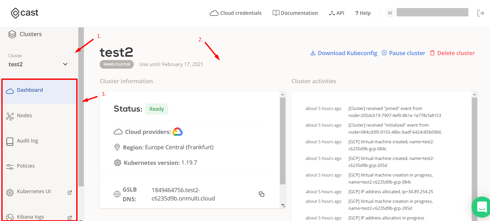

# Clusters

When you open any cluster from the /dashboard menu you will arrive at /clusters management.

Here you will see more information about the selected cluster and will get access to the cluster management menu.

1. Quickly navigate through active clusters.
2. Information and log of the selected cluster.
3. Management menu.

