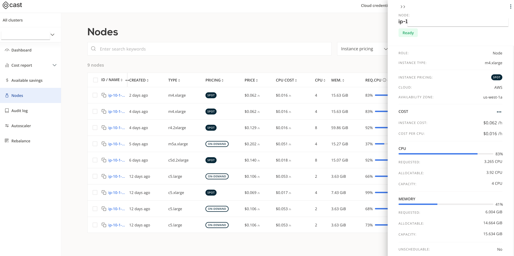
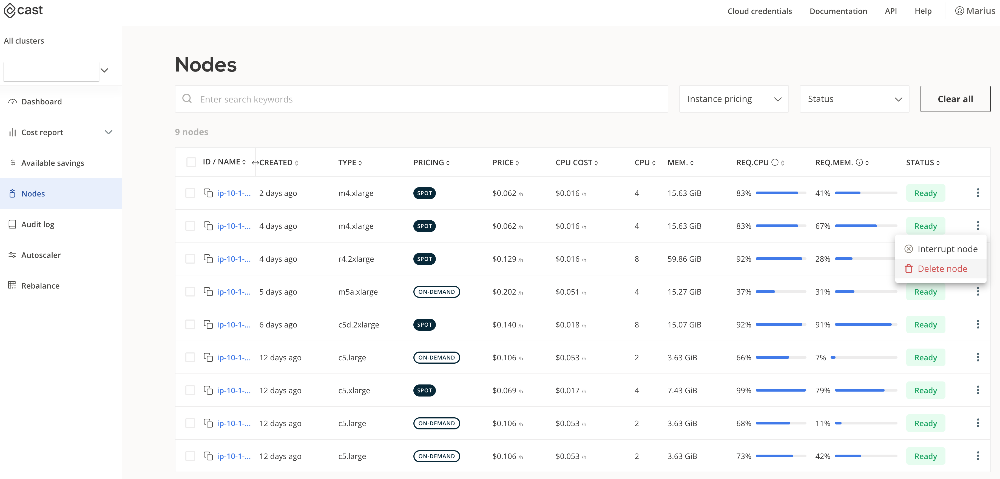
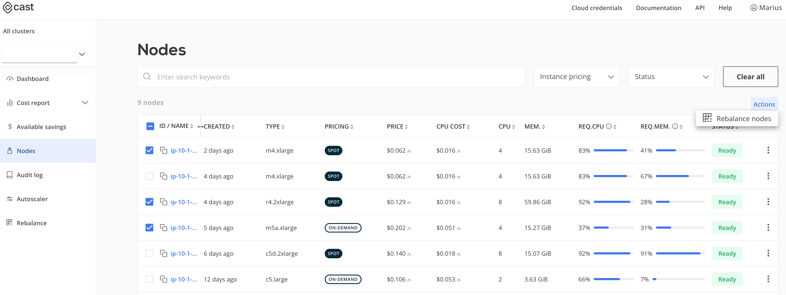

# Nodes

Nodes view provides information about the nodes in the cluster. It allows you to quickly find a specific node, or sort and filter the list based on criteria. Depending on the use case, you can quickly identify the most expensive node, or the one that's failing to join the cluster.

Apart from sorting and filtering, following actions can be performed on the selected nodes.

  1. View additional details about each individual node, just by clicking on it in the list

  
  2. Delete a node or interrupt it (in case of spot nodes)

  
  3. Select specific nodes to rebalance

  
