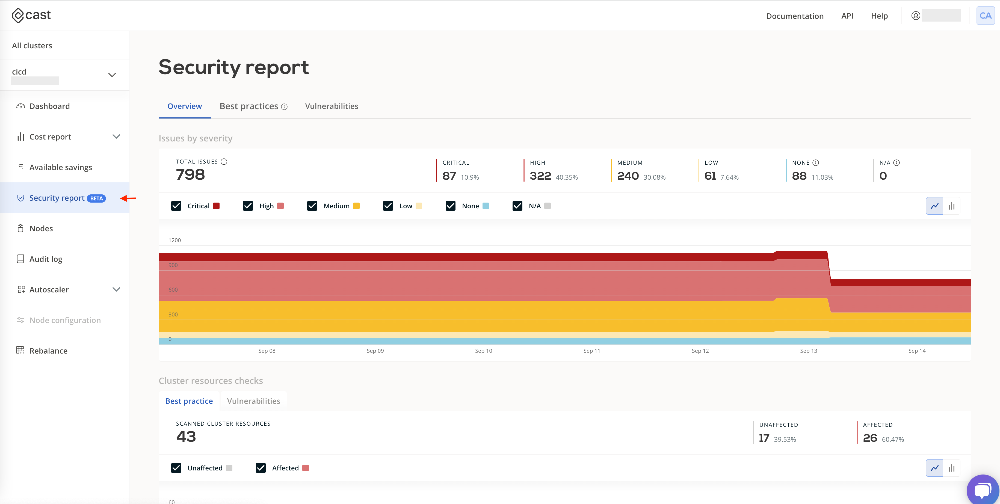
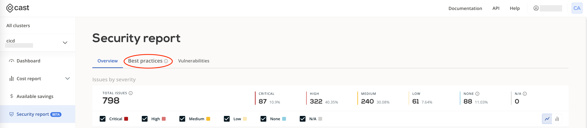
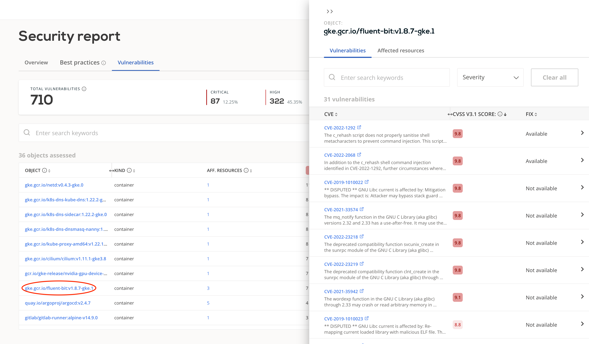

# Security Report

CAST AI performs various checks on information gathered by CAST AI agents.
CAST AI security insights provide security recommendations for your Kubernetes clusters.
You can visit the "Security Report" page from the side menu to see security insights.

## Overview

When visiting Security Report, you will first see an overview of your cluster.
The overview page lets you understand how the security issues detected by CAST AI changed over time.
The top section of the overview page represents the state of failed checks in your cluster.
In the diagram, you can see how that state has changed over time.
Above the diagram, you can see the current state of security checks.

The bottom section of the overview page is tabbed.
Tab "Best practices" shows an overview of Kubernetes resources that CAST AI checked for possible misconfigurations.

Tab "Vulnerabilities" shows how many Kubernetes resources CAST AI scanned for vulnerabilities.

## Best Practices

When you install the CAST AI agent, it observes changes in your Kubernetes cluster.
CAST AI uses this information to check for possible misconfigurations and provides recommendations.
To view a report on Kubernetes resource misconfigurations, you should go to the "Best Practices" tab from the Security Report page.

The "Best Practices" report page also has two sections.
In the top section of the "Best Practices" page, there is a summary of the current state report.
You can browse all the performed checks and their status in the area below.

While browsing the list of checks, you can click on the check name to see more detailed information about it.

In the details sidebar, you will see a description of the check, issue severity level, issue severity score, category, and CVSS3 vector.
CAST AI uses the CVSS3 standard to determine the issue's severity score and severity level.
Click on "Resources with the issue" to look at the resources that have this issue.

## Vulnerabilities

CAST AI can also check container images and operating systems for potential vulnerabilities. To see these observations, open the "Vulnerabilities" tab.

The vulnerabilities report also contains two sections. The top section summarizes the current information state, and in the area below, you can browse the report items.
By clicking on an item in the list, you will open a sidebar with more information about it.

Details sidebar has two tabs - "Vulnerabilities" and "Affected resources."
The vulnerabilities tab contains a list of CVE (Common Vulnerabilities and Exposures) associated with an item.
You can click the CVE to open its description in the new browser window.
In the "Affected resources" tab, you will see Kubernetes objects related to this item.
