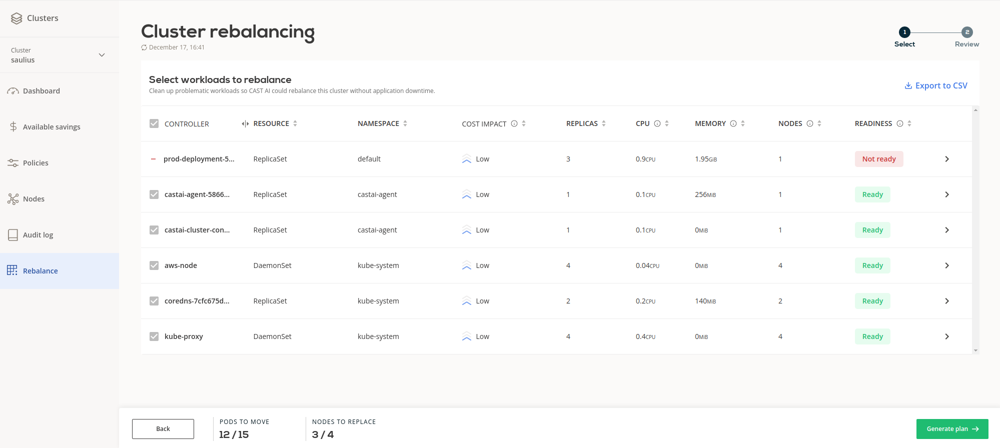

# Preparation

## Problematic workloads

Rebalancing replaces your suboptimal nodes with new ones. However, that is only done on nodes which aren't running any problematic workloads. To increase the value of the rebalancing operation, you should decrease the number of problematic pods as much as possible.

Problematic workloads are pods which have unsupported node selector criteria. For example, pods which have a declared required node affinity on a custom label are considered problematic:

```yaml
spec:
  affinity:
    nodeAffinity:
      requiredDuringSchedulingIgnoredDuringExecution:
        nodeSelectorTerms:
          - matchExpressions:
              - key: environment
                operator: In
                values:
                  - production
```

For a full list of supported node selector criteria visit the [Configure pod placement by topology](../../guides/pod-pinning.md) section.

Go to the Rebalance page of your cluster to find the workloads which are preventing some nodes from being rebalanced. Check the Readiness column:



## Minimize disruption

Existing nodes will be drained and the workloads will be migrated to the new nodes during the rebalancing. This mean that this process might be disruptive to your workloads. Rebalancing aims to minimize disruption by first creating new nodes and then draining the old ones.

If your workloads do not tolerate interruptions, you might need to take special care. You have multiple options:

1. Execute the rebalancing during maintenance hours. This would help you achieve the most cost savings.
2. Disable rebalancing for certain workloads. This can be achieved by marking the nodes which are running the critical pods by adding the `autoscaling.cast.ai/removal-disabled` label:

    Find the node that hosts your critical pod:

    ```shell
    kubectl get pod -ojsonpath='{.spec.nodeName}' critical-deployment-5ddb8f8995-94wdb
    ```

    Label the node that is running your critical pod:

    ```shell
    kubectl label node ip-10-0-101-156.eu-central-1.compute.internal autoscaling.cast.ai/removal-disabled=true
    ```
