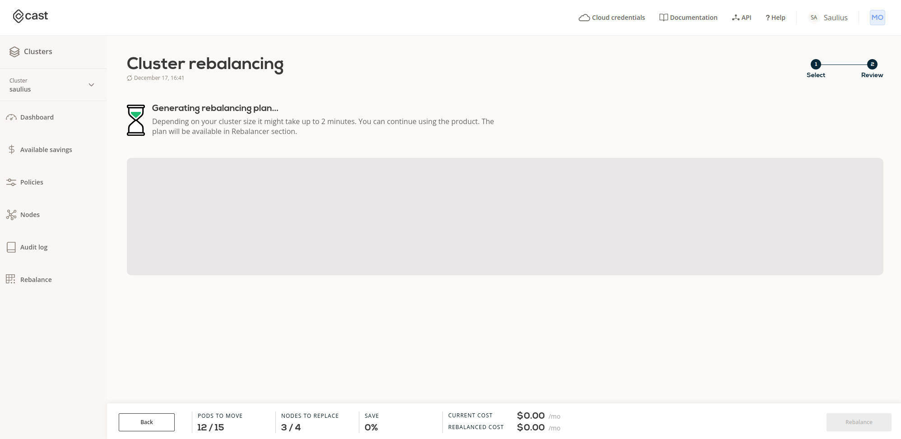

# Rebalance your cluster

Rebalancing your cluster will help you achieve cost savings. Before running the rebalancing process, we recommend you read the [Preparation](preparation.md) section.

## Generate the rebalancing plan

Click on your cluster's Rebalance tab to inspect the workload for any problems:

After inspecting the workloads click on the Generate plan button. This will redirect you to the rebalancing plan page. Depending on the size of your cluster, the plan generation might take up to two minutes:

When the plan is generated, you can inspect how the cluster node configuration will look like after the rebalancing process is finished:

## Execute the rebalancing plan

Once you're ready to rebalance, click the Rebalance button. Rebalancing is executed in three distinct phases, executed sequentially:

1. Create new optimal nodes.
2. Drain old suboptimal nodes.
3. Delete old suboptimal nodes.

When all phases complete successfully, you can enjoy great savings:

